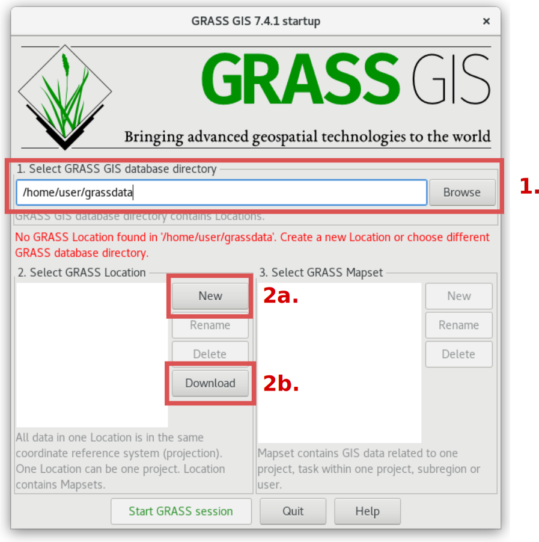
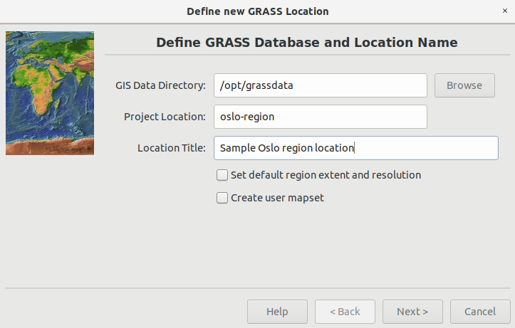
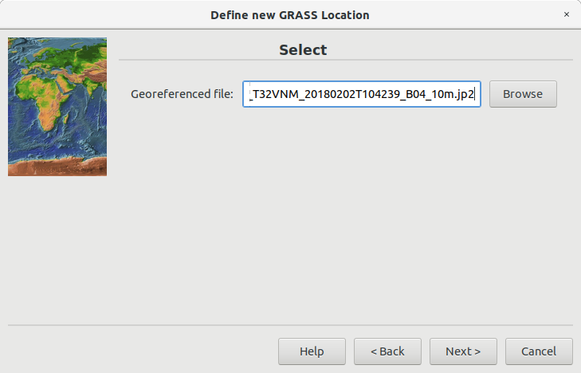
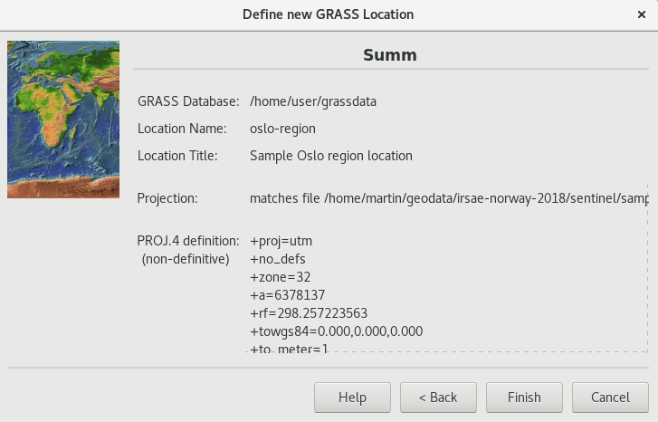
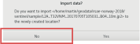
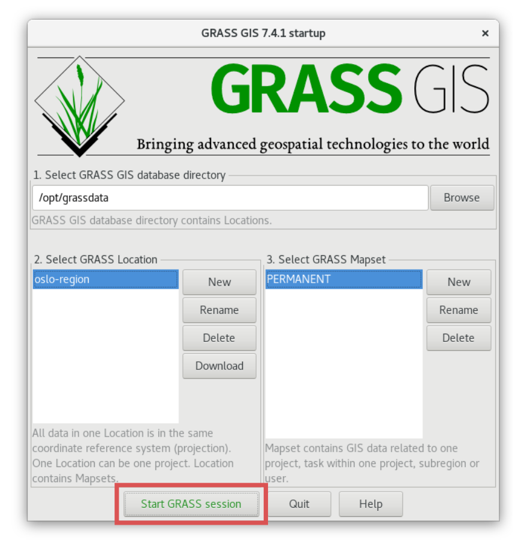
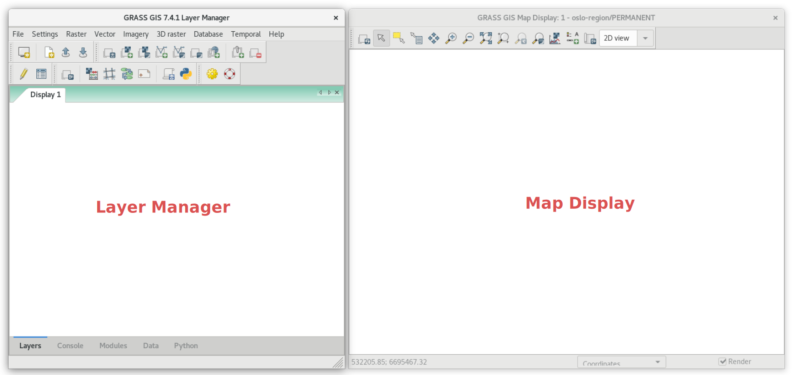

Unit 02 - First steps
=====================

Startup
-------

Starting a GRASS session requires basic knowledge about software
itself. It is an obstacle especially for newcomers. In other words
GRASS forces organizing your data from early beginning.

Before entering GRASS a startup screen appears, the user must define
working project in which GRASS session will operate. Without this step
you cannot enter GRASS. Such approach is not so common. Applications
like Esri ArcGIS or QGIS just starts. The user loads different data
from various data sources in different projections, and starts working
on his/her project. GRASS is different, which makes this software
harder to enter for newcomers. *But don't worry, we will enter our
first GRASS sessions in few steps.*

The GRASS GIS startup screen requires to set up three items:

#. **Database directory.** A directory on local or network disc which
   contains all data accessed by GRASS. It's usually directory called
   :file:`grassdata` located in a user's home directory. *This item is
   set up on Windows automatically, so usually you don't need to
   care about it.*

#. **Location**. Plays a role of "a project". All geodata stored
   within one location must have the same spatial coordinate system
   (GRASS doesn't support on-the-fly projection from several reasons).

#. **Mapset** Contains task-related data within one project. Helps
   organizing data into logical groups or to separate parallel work of
   more users on the same project.

.. _startup0:
   

   GRASS GIS startup screen.

At first define database directory (:fignote:`1.`) if not already set
up. Then a new location can be created (:fignote:`2a.`) or official
GRASS sample location(s) downloaded (:fignote:`2b.`). We will create
our own location, a project related to *Oslo region*.

.. note:: Download sample location functionality is available only in
   GRASS 7.4+.

.. _create-location:

Create a new location
---------------------

A new GRASS location can be easily created by EPSG code or available
geodata. After pressing :item:`New` button, see :numref:`startup0`
(:fignote:`2a.`), the Location Wizard shows up.

In the first page of a wizard, a location name is defined, optionally
also short description can be added.

   Define a name for new GRASS location.

Then a method for creating new location is chosen. Usually a location
is created using given EPSG code (*Select EPSG code of spatial
reference system*) or from existing data (*Read projection and datum
terms from a georeferenced data file*). In our case a new location
will be created based on sample Sentinel data (eg.
:file:`L2A_T32VNM_20170705T105031_B04_10m.jp2` file located in
:file:`sentinel/sample` directory of sample dataset).

.. figure:: ../images/units/02/create-location-1.png

   Choose method for creating a new GRASS location.

In the next page define an input file.

   Define an input file.

Spatial reference system of created location is chosen based on input
file (here WGS84 / UTM zone 32N :epsg:`32632`).

   Check the summary.

After creating a new location (:item:`Finish` button) the user can
optionally import input data. We will skip this operation at this
moment since we are going to import input data later by more advanced
GRASS importer.
          

                     
   Skip importing input data.
   
Now we can *finally* start a GRASS session by entering our first GRASS
location.

   Entering a GRASS session.

.. note:: By default GRASS creates in a new location a PERMANENT
   mapset. Let's keep it simple at this moment and enter PERMANENT
   mapset. Later we will try organizing our work into more mapsets.

GUI
---

GRASS GUI is designed as an *simple* user interface. Basically it is
just a GUI front-end calling GRASS commands (see :ref:`grass-modules`)
in the background. After startup, the GUI appears. It consists of two
main windows: *Layer Manager* and *Map Display*, see
:numref:`gui-windows`.

.. _gui-windows:

           
   Main GUI components: Layer Manager and Map Display.

.. tip:: If GUI crashes, it can be started again by :grasscmd:`g.gui`
   command from underlaying terminal (command prompt).
