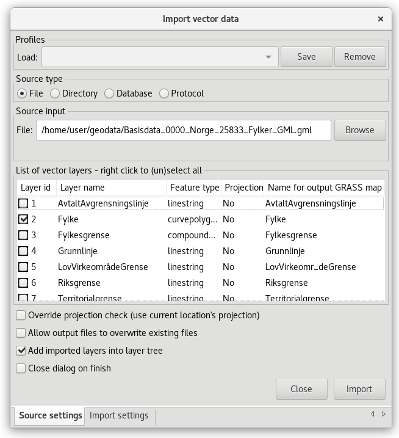
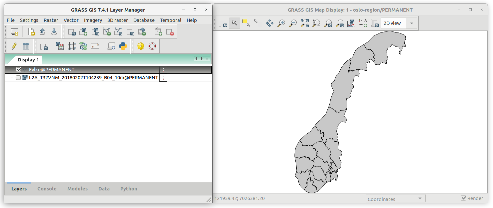
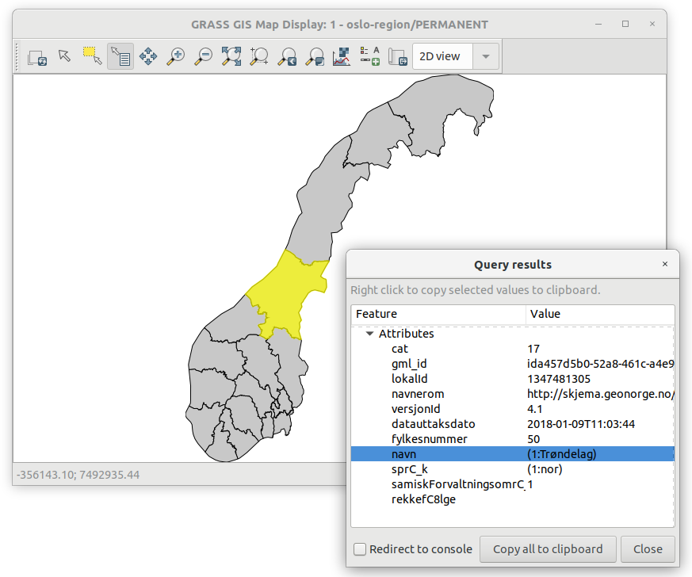
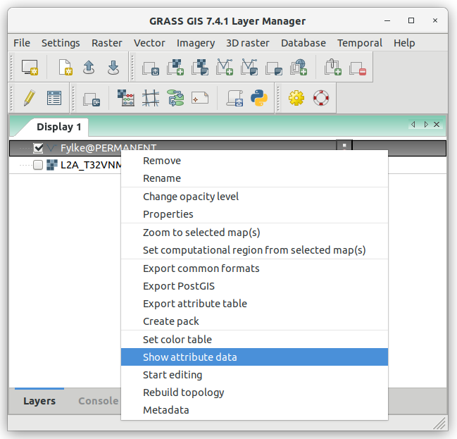
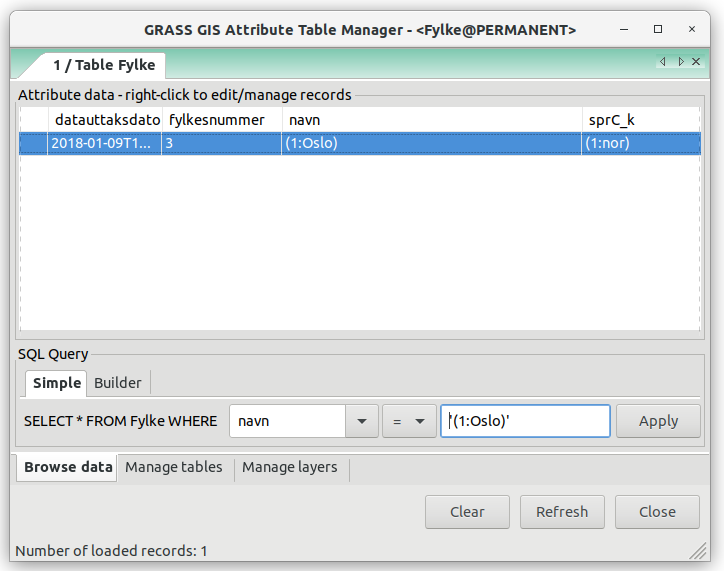
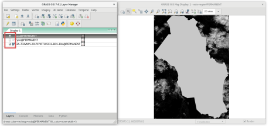

Unit 03 - Data Management
=========================

.. warning:: Materials under construction!

Data can be imported simply from toolbar by tools dedicated for
:wikipedia:`raster <GIS_file_formats#Raster>` or :wikipedia:`vector
<GIS_file_formats#Vector>` GIS data formats |grass-layer-import|. Basic
knowledge of commonly used :wikipedia:`GIS file formats` is required.

.. note:: GRASS terminology differs from commonly used GIS
          packages. To avoid confusion let's focus on the most
          important terms. Commonly used term "a layer" is called in
          GRASS "a map". GRASS layer is subset of features with one
          "map". So "GRASS raster map" can be treated as "a raster
          layer" in other GIS packages.
          
          
Import GIS data
---------------

Let's start with data file used for creating our project location in
:doc:`02`. :file:`L2A_T32VNM_20180202T104239_B04_10m.jp2` is a
:wikipedia:`JPEG2000` file, which is nowadays commonly used GIS
*raster* format for imagery data.

Raster data
^^^^^^^^^^^

.. todo:: TBD
   
Vector data
^^^^^^^^^^^

Norway administrative regions are stored in
:file:`Basisdata_0000_Norge_25833_Fylker_GML.gml` :wikipedia:`GML`
file, which is a commonly used GIS exchange *vector* format.

.. figure:: ../images/units/03/import-vector-toolbar.png

   Import vector data from the main toolbar.

.. note:: Dialog for importing vector data is also accessible from
   menu :menuselection:`File --> Import vector data --> Simplified
   vector import with reprojection` or from command line by
   :grasscmd:`v.import` module.

Import dialog allows importing single vector file (:item:`File`) or
multiple files from directory (:item:`Directory`). In our case single
file is planned to be imported, we keep default data source
(:item:`File`).

.. important:: If a spatial reference system (SRS) of vector file differs
   from GRASS location (:item:`Project match`) input vector data are
   automatically reprojected (*please forget about on-the-fly
   reprojection*, GRASS simply does not support such dangerous
   feature) into location projection.

   Dialog for importing vector file(s). Input file
   :file:`Basisdata_0000_Norge_25833_Fylker_GML.gml` contains several
   layers, we choose "Filke" (administrative regions) to import.

.. note:: In some cases SRS of imported file can be missing or
          invalid. GRASS reports this issue as *In case of no
          significant differences in the projection definitions, use
          the -o flag to ignore them and use current location
          definition.  Consider generating a new location from the
          input dataset using the 'location' parameter.*

          GRASS allows importing such file by overriding project check
          (if you are really sure that SRS of input file is the same
          as GRASS location).

          .. figure:: ../images/units/03/override-projection-check.svg

             Override projection check to force import.

After successful operation imported data layer should be automatically
displayed in map window.

           
   Imported Norway administrative regions.

Querying data
-------------

Imported raster or vector data layers can be iteractively queried by
|grass-info| from Map Window toolbar.

           
   Query interactively Norway administrative regions.

Vector data layers (GRASS vector maps) can be queried also by
attribute filters using Attribute Table Manager |grass-table|.

           
   Open Attribute Table Manager from layer menu.

Vector features can be queried by simple SQL queries by WHERE
statement.

           
   Simple attribute querying.

.. tip:: GRASS offers also interactive tool for attribute querying
         similarly to other GIS packages. The tool accessible from
         :item:`Builder` tab as :item:`SQL Builder`.

         .. figure:: ../images/units/03/advanced-query.svg
           
            Open SQL Builder.

         .. figure:: ../images/units/03/sql-builder.png
            :class: small
            
            SQL Builder in action.
            
Selected vector objects (commonly refered as "features" in GIS
terminology) can be saved into new layer (GRASS vector map) from menu
by :menuselection:`Extract selected features`.

.. figure:: ../images/units/03/extract-menu.png
   :class: large
   
   Extract selected features into a new vector map.

Created vector map is automatically added into Layer Tree. Switch
visibility of map layers by checkboxes and zoom to currently selected
map by |grass-zoom-extent| as shown on :numref:`oslo-region`.

.. _oslo-region:

   
   Extract Oslo region displayed in Map Window.
