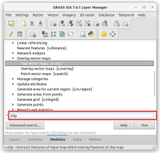
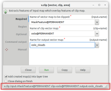
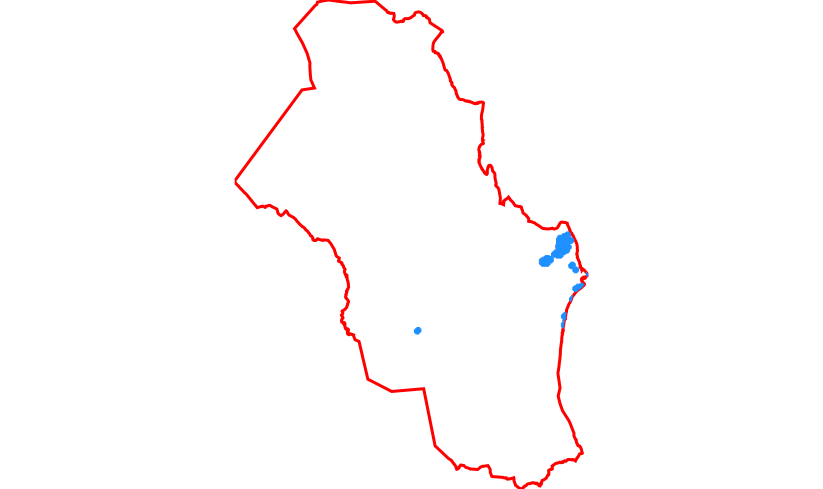
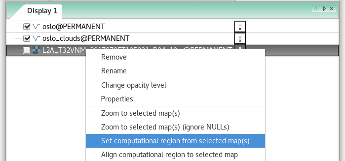
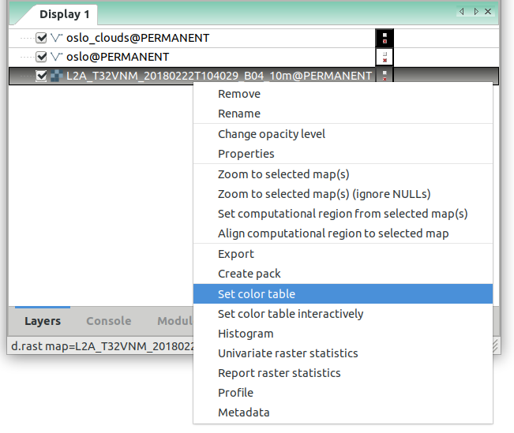
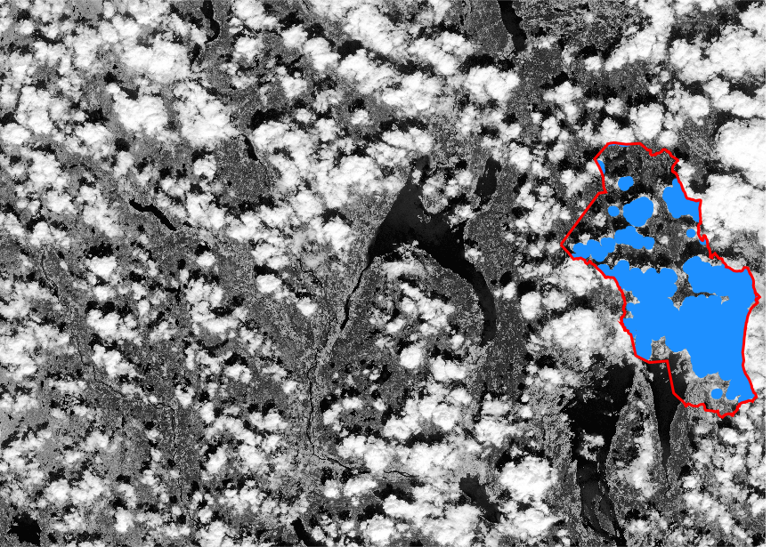

Unit 04 - Modules, Region
=========================

.. _grass-modules:

Accessing GRASS modules
-----------------------

GRASS is a **modular system** which consists of several hundreds tools
(called "modules"). Modules are accessible from the Layer Manager menu,
:item:`Modules` tab, or from command prompt (:item:`Console` tab).

At first import *vector* cloud mask data layer
:file:`MSK_CLOUDS_B00.gml` located in :file:`sentinel/sample`
directory similarly as done in :ref:`import-vector-section`
(:doc:`03`).

.. warning:: :file:`MSK_CLOUDS_B00.gml` file does not include
   information about SRS. It is neccesary to enable *Override
   projection check* before importing data (see :ref:`Unit 03
   <import-no-srs>` for details).

Then find a tool for clipping cloud mask vector map by Oslo
region. 

   Searching module in Layer Manager by 'clip' keyword. The module
   which we are looking for is :grasscmd:`v.clip`. Module dialog is
   open by :item:`Run` button.

.. note:: Module :grasscmd:`v.clip` has been introduce to GRASS in
   version 7.4.0. In older versions more generic :grasscmd:`v.overlay`
   module can be used.

The commands (modules) can be called using GUI dialogs, from command
line (:item:`Console` or "real" terminal), or by using Python API (see
:doc:`10`). Figure bellow shows GUI dialog of :grasscmd:`v.clip`
module.

.. _v-clip:

   GUI dialog for launching :grasscmd:`v.clip` module.

.. tip:: CLI syntax of modules is shown in GUI dialog statusbar, see
         :numref:`v-clip`. Command can be copied to clipboard by
         :item:`Copy` button for later usage.

The corresponding command for console would be:

.. code-block:: bash

   v.clip ainput=MaskFeature binput=oslo output=oslo_clouds

   Clipped clouds mask by Oslo region.

As you can see from example above GRASS commands start by a
prefix. This prefix groups modules into several sections, see table
below.

.. cssclass:: border

+----------+--------------------------------+-----------------------------------------------+
| prefix   | section                        | description                                   |
+==========+================================+===============================================+
| ``db.``  | :grasscmd:`database`           | attribute data management                     |
+----------+--------------------------------+-----------------------------------------------+
| ``d.``   | :grasscmd:`display`            | display commands                              |
+----------+--------------------------------+-----------------------------------------------+
| ``g.``   | :grasscmd:`general`            | generic commands                              |
+----------+--------------------------------+-----------------------------------------------+
| ``i.``   | :grasscmd:`imagery`            | imagery data processing                       |
+----------+--------------------------------+-----------------------------------------------+
| ``ps.``  | :grasscmd:`postscript`         | map outputs                                   |
+----------+--------------------------------+-----------------------------------------------+
| ``r.``   | :grasscmd:`raster`             | 2D raster data processing                     |
+----------+--------------------------------+-----------------------------------------------+
| ``r3.``  | :grasscmd:`raster3D`           | 3D raster data processing                     |
+----------+--------------------------------+-----------------------------------------------+
| ``v.``   | :grasscmd:`vector`             | 2D/3D vector data processing                  |
+----------+--------------------------------+-----------------------------------------------+

.. _region:

Computational region
--------------------

Computation region is a **key issue** in GRASS raster
processing. Unlike GIS software like Esri ArcGIS which sets
computation region based on input data, GRASS is leaving this
operation to the user.

.. important:: **The user must define computation region before any
   raster computation is performed!**

Computational region is defined by *extent* (north, south, east, west)
and by *spatial resolution* in the both directions (east-west,
north-south). Note that GRASS supports only regular grids.

.. figure:: ../images/units/04/region2d.png
              
   2D computation region grid.

.. note:: For 3D raster data (known as "volumes") there is an
   extension to 3D computation grid.

Majority of raster processing GRASS modules (``r.*``) respect
computational region, there are a few exceptions like import modules
(eg. :grasscmd:`r.import`). On the other hand, the most of vector
processing modules (``v.*``) ignore computation region completely
since there is no computation grid defined by them.

Computational region can be easily set on existing raster or vector
map from Layer Manager.

   Set computational region from raster map.

Note that when setting up computational region from vector map, only
extent is adjusted. It's good idea to align the computational grid
based on raster map used for computation (*Align computational region
to selected map*).
          
.. tip:: Current computation extent can be displayed in map window.

   .. figure:: ../images/units/04/show-comp-region.png

      Show computation region extent in Map Window.

Full flexibility for operating with computation region allows
:grasscmd:`g.region` module (:menuselection:`Settings --> Computational
region --> Set region`). Example below:

.. code-block:: bash

   g.region vector=oslo align=L2A_T32VNM_20180222T104029_B04_10m

Color table
-----------

With knowledge of computational region let's enhance color table of
imported Sentinel band using histogram equalization (which is
influenced by computation region as we already know) by using
:grasscmd:`r.colors` command.

   Set color table from Layer Manager.
          
.. tip:: Color table can be easily set also from Layer Manager or
   managed interactively by :menuselection:`Raster --> Manage
   colors --> Manage color rules interactively`.

.. figure:: ../images/units/04/r-colors.png

   Set 'grey.eq' color table.

.. code-block:: bash

   r.colors map=L2A_T32VNM_20180222T104029_B04_10m color=grey.eq
   

   
   Sentinel 4th band with enhanced grey color table.
