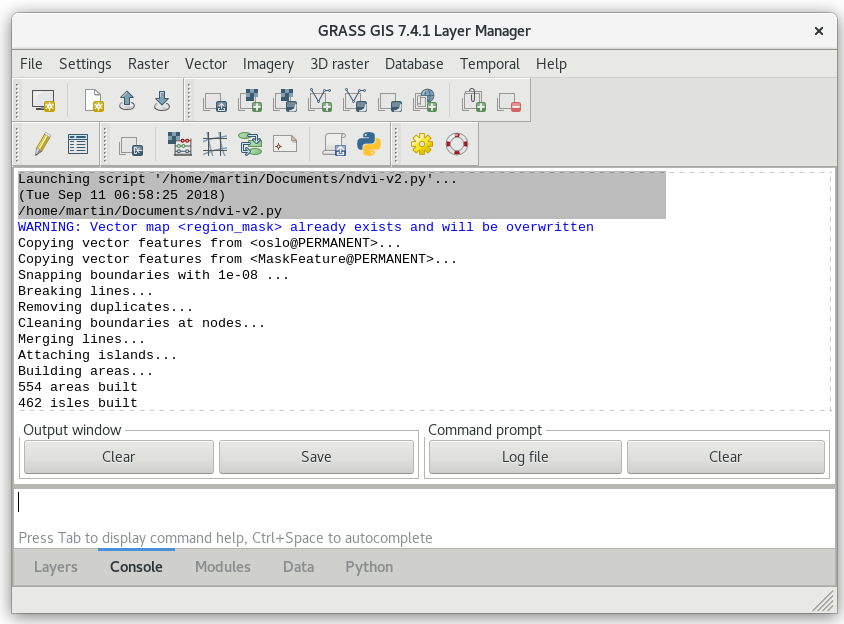
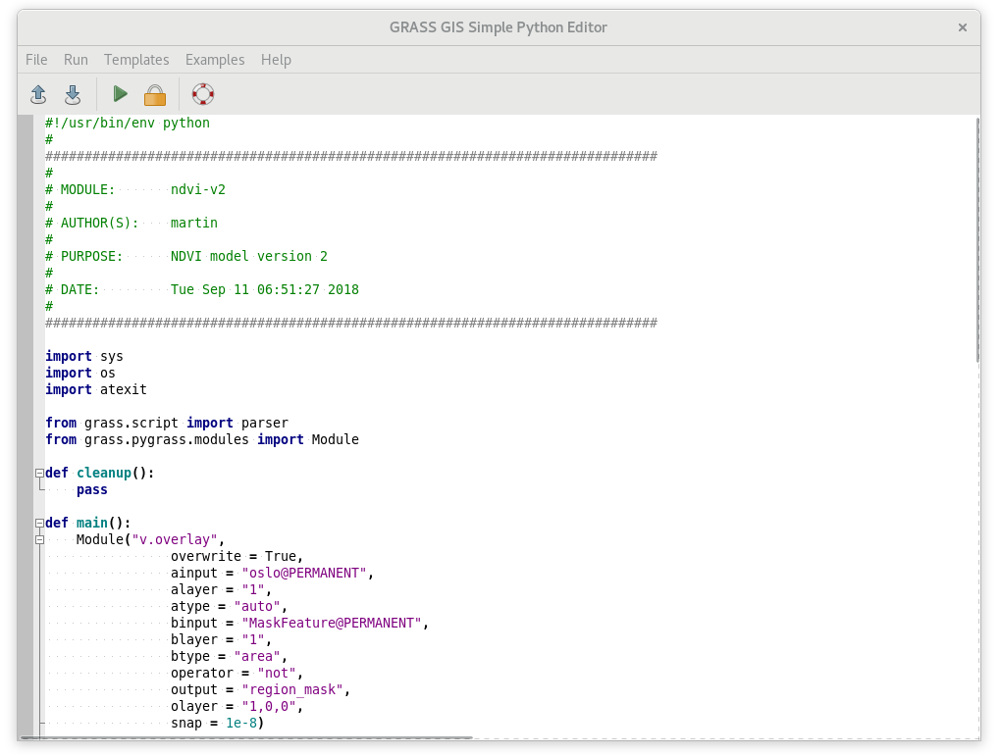

Unit 11 - PyGRASS scripting
===========================

Let's start with a Python script created by *Graphical modeler* in
:ref:`Unit 10 <modeler-python>` saved into file.

.. important:: Before saving the script we will remove the lines
   below to avoid generating GUI dialogs when launching the script.

   .. code-block:: python

      #%module
      #% description: NDVI model version 2
      #%end       

Then we can try to run a script from Layer Manager |grass-script-load|
:sup:`Launch user-defined script` main toolbar.

.. note:: Before starting a script GRASS can ask you to add script
   directory path into GRASS_ADDON_PATH. It can be useful if you will
   run script(s) from this directory more often. Then you don't need
   to define full path to the scripts, its name will be enough.
   
   .. figure:: ../images/units/11/addon-path.png
      :class: small
           
      Register script directory into GRASS Addon Path.

After selecting a script to run, the command output will be printed in
Layer Manager :item:`Console` tab.

   Script output printed in Layer Manager Console.

Python script generated by Graphical Modeler is based on GRASS
Scripting Library. As a first step the script will be rewritten into
PyGRASS syntax.

PyGRASS scripting
-----------------

Open Python script by your favorite editor or if your do not have any
use GRASS integrated Python editor |grass-python| :sub:`Open a simple
Python code editor`.

   Simple GRASS Python code editor in action.

Load script by |grass-open| :sup:`Open` and replace every occurence of
:grass-script:`core.run_command` function by PyGRASS
equivalent. PyGRASS allows calling GRASS modules similarly as GRASS
Scripting Library does (see :doc:`10`). The module caller is
represented by :pygrass-modules:`Module` class. In contrast to GRASS
Scripting Library which defines several routines to run module
(:grass-script:`core.run_command`, :grass-script:`core.read_command`,
or :grass-script:`core.feed_command`) in PyGRASS there is only one
caller technique.

Replace all occurrence of :grass-script:`core.run_command` function by
:pygrass-modules:`Module` caller, see example below.

.. code-block:: python

   from grass.script import run_command

   run_command("v.overlay",
                overwrite = True,
                ainput = "oslo@PERMANENT",
                alayer = "1",
                atype = "auto",
                binput = "MaskFeature@PERMANENT",
                blayer = "1",
                btype = "area",
                operator = "not",
                output = "region_mask",
                olayer = "1,0,0",
                snap = 1e-8)
by

.. code-block:: python

   from grass.pygrass.modules import Module

   Module("v.overlay",
          overwrite = True,
          ainput = "oslo@PERMANENT",
          alayer = "1",
          atype = "auto",
          binput = "MaskFeature@PERMANENT",
          blayer = "1",
          btype = "area",
          operator = "not",
          output = "region_mask",
          olayer = "1,0,0",
          snap = 1e-8)
                 
.. warning:: There are some caveats. Mupliple options given as a string in
   GRASS Scripting Library must be given as a list of strings
   in PyGRASS, see :grasscmd:`v.clean` example below.

   .. code-block:: python

      run_command("v.clean",
                  ...
                  type = "point,line,boundary,centroid,area,face,kernel",
                  ...
                         
   .. code-block:: python
                          
      Module("v.clean",
             ...
             type = ["point","line","boundary","centroid","area","face","kernel",
             ...

In the next step the script will be improved by printing NDVI value
statistics (be aware of indentation), see :ref:`Unit 10
<python-code>`.
             
.. code-block:: python

   from subprocess import PIPE
   from grass.script import parse_key_val
   
   ret = Module('r.univar', flags='g', map='ndvi', stdout_=PIPE)
   stats = parse_key_val(ret.outputs.stdout)
   print ('-' * 80)
   print ('NDVI value statistics')
   print ('-' * 80)
   print ('NDVI min value: {0:.4f}'.format(float(stats['min'])))
   print ('NDVI max value: {0:.4f}'.format(float(stats['max'])))
   print ('NDVI mean value: {0:.4f}'.format(float(stats['mean'])))

Launch script by |grass-execute| :sup:`Run` and check out an output in
Layer Manager :item:`Console` tab.

.. figure:: ../images/units/11/run-script.svg
   :class: large
        
   Run script from Python editor.
