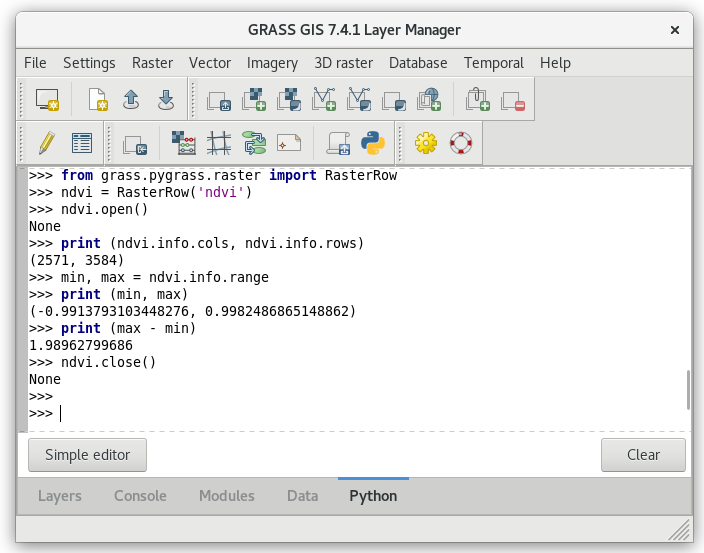

Unit 13 - PyGRASS Raster Access
===============================

PyGRASS allows directly accessing native GRASS raster and vector maps
in the sense of Python objects. This unit shows how to deal with GRASS
raster data by PyGRASS API, see :doc:`14` for vector data.

Raster data
-----------

Raster map can be treated by :pygrass-raster:`RasterRow` for reading
raster data row by row. There is also :pygrass-raster:`RasterSegment`
which allows reading data by user-defined segments (tiles).

.. code-block:: python

   from grass.pygrass.raster import RasterRow
   ndvi = RasterRow('ndvi')

Raster map is open by ``open()`` method. Basic information like number
of columns and rows, min and max values, range printed.
   
.. code-block:: python

   ndvi.open()
   print (ndvi.info.cols, ndvi.info.rows)
   min, max = ndvi.info.range
   print (min, max)             
   print (max - min)
                

   Running PyGRASS code from Python tab of Layer Manager.

Don't forget to close the raster map at the end.

.. code-block:: python

   ndvi.close()

Raster statistics example
-------------------------

A simple PyGRASS script for computing basic univariate raster
statistics below.

.. literalinclude:: ../_static/scripts/ndvi-pygrass-univar.py
   :language: python

.. tip:: Compare computation speed of your simple script with C-based
   :grasscmd:`r.univar` module...

   .. figure:: ../images/units/13/r-univar.png

      PyGRASS script and :grasscmd:`r.univar` comparision.
             
Sample script to download: `ndvi-pygrass-univar.py
<../_static/scripts/ndvi-pygrass-univar.py>`__
