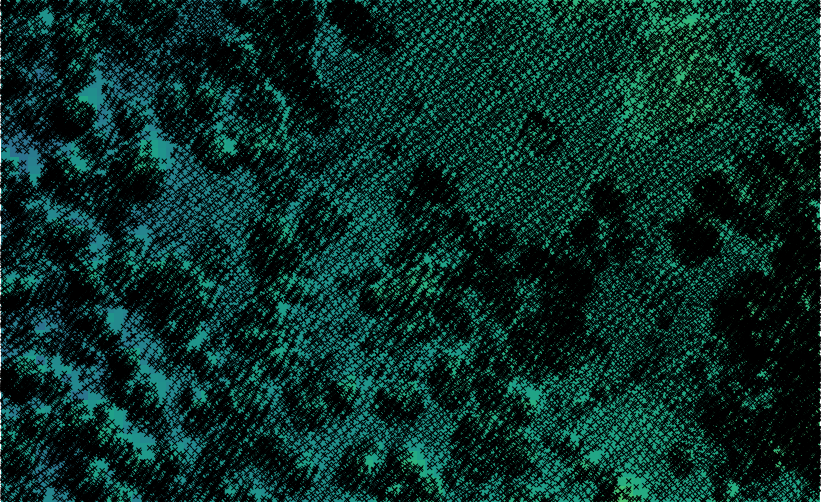
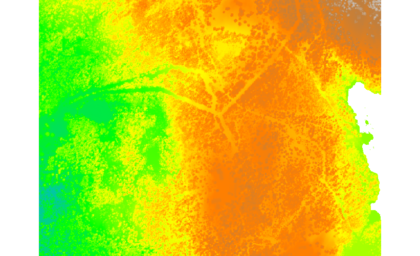

Unit 16 - Lidar
===============

There is open LiDAR data for Norway available at
`hoydedata.no <http://www.hoydedata.no/>`__. Go to `Download 
<http://www.hoydedata.no/>`__, choose region in map viewer and request data for download.

LiDAR data used in this unit can be found in sample dataset, in
:file:`~/geodata/lidar/laz` folder. Data is stored in LAZ format
(compressed LAS format).
   
Data import
-----------

For importing LAS/LAZ data there are available two GRASS modules:

* :grasscmd:`r.in.lidar` for importing point cloud data as raster map
* :grasscmd:`v.in.lidar` for importing point cloud data as vector point map

.. note:: GRASS requires `libLAS <http://www.liblas.org>`_ library for
   reading LAS data. For compressed LAS (LAZ) there is another
   dependency, a `laszip <https://www.laszip.org/>`__ library.

   Basic metadata can be obtained by command line utility ``lasinfo``
   which is part of libLAS library.

   .. code-block:: bash

      lasinfo ~/geodata/lidar/laz/32-1-514-136-15.laz

      ...
      Min X Y Z:                   590400.00 6655800.00 283.31
      Max X Y Z:                   591199.99 6656399.99 499.04
      ...

Vector import
^^^^^^^^^^^^^

Create a new mapset called `lidar` to save all the LiDAR data.

Let's try to import selected tile into vector point map first. Flag
:param:`-t` skips creation of attribute table. The import process will
be significantly faster. Another flag which will speed up the import
process is :param:`-b`. It skips building :ref:`topology
<vector-topo-section>` (which is not needed for point features
anyway). Information about data SRS can be missing, projection check
can be skipped by :param:`-o` flag.

.. code-block:: bash
                
   v.in.lidar -otb input=~/geodata/lidar/laz/32-1-514-136-34.laz output=las_32_1_514_136_34

Note that computational region is ignored when importing data using
:grasscmd:`v.in.lidar`.

Overall point density can be checked by :grasscmd:`v.outlier`. Note
that :grasscmd:`v.outlier` is working in the current computation
region(!). Computational region must be set based on imported
data. Since building topology was skipped by :param:`-b` flag, the map
extent must be computed by scanning all points in input vector
map. That is reason why :grasscmd:`g.region` can run for a while.

.. code-block:: bash

   g.region vector=las_32_1_514_136_34
   v.outlier -e input=las_32_1_514_136_34

::

   Estimated point density: 9.827
   Estimated mean distance between points: 0.319

.. note:: Point density is calculated for map (square) unit.
          
Basic metadata can be printed by :grasscmd:`v.info` (since no topology
is built, the module must scan all features in the map):

.. code-block:: bash
                   
   v.info map=las_32_1_514_136_34

::
   
   ...
   |   Number of points:       4716789         Number of centroids:  0          |
   ...
   |   Map is 3D:              Yes                                              |
   ...
   |   Projection: UTM (zone 32)                                                |
   |                                                                            |
   |               N:        6655799.99    S:           6655200                 |
   |               E:         592799.99    W:            592000                 |
   |               B:            315.87    T:            431.17                 |
   ...
   
Raster import
^^^^^^^^^^^^^

Input point cloud can be imported by :grasscmd:`r.in.lidar` into
raster map. Flag :param:`-e` extends current computational region to
cover all imported points. Otherwise user needs to set up
computational region by :grasscmd:`g.region`. Spatial resolution for
output raster map is defined by :param:`resolution` option. By
default, for cells with more points involved, the value is computed by
mean value, see :param:`method` option. Cells covered by no points
will get NULL values assigned.
   
.. code-block:: bash

   r.in.lidar -oe input=~/geodata/lidar/laz/32-1-514-136-34.laz output=las_32_1_514_136_34 resolution=1

Basic metadata about created raster map can be obtained by
:grasscmd:`r.info`.

.. code-block:: bash

   r.info map=las_32_1_514_136_34

::
   
   ...
   |            N:    6655800    S:    6655200   Res:     1                     |
   |            E:     592800    W:     592000   Res:     1                     |
   |   Range of data:    min = 315.92  max = 429.5867                           |
   ...

.. figure:: ../images/units/16/import-rast-vect.png

   Imported data as vector points. Raster map with 1m resolution in the
   background.

Filling gaps
------------

There are several GRASS modules for filling gaps in raster maps like
:grasscmd:`r.fillnulls` or :grasscmd:`r.fill.stats`. The first module
is based on spline interpolation, the second fills gaps with
interpolated values using IDW. We will use the second module which
fill nulls rapidly compared to :grasscmd:`r.fillnulls`. By
:option:`-k` flag we ensure that original values will be kept. Only
cells with no-data value will be modified.

.. code-block:: bash

   r.fill.stats -k input=las_32_1_514_136_34 output=las_32_1_514_136_34_no_gaps

   NULL values (on left part) filled by :grasscmd:`r.fill.stats`
   (right part).

.. note::

   Note that only cells in given distance (8 pixels by default, see
   :option:`cells` option) are processed.

.. _edge-detection:

High resolution DSM
-------------------

Digital Surface Model (DSM) is interpolated by :grasscmd:`v.surf.rst`
using regularized spline with tension approximation. Output resolution
set to 0.5 meter. The computation can be really slow. You can turn
computation time to be more reasonable by running it in parallel, see
:option:`nprocs` option (GRASS 7.4+ only).

.. code-block:: bash

   g.region vector=las_32_1_514_136_34 res=0.5 -pa
   v.surf.rst input=las_32_1_514_136_34 elevation=dsm_32_1_514_136_34 npmin=80 tension=20 smooth=1 nprocs=5

.. tip:: Try also to set higher npmin to reduce artifacts.
      

   Resultant DSM.

.. note:: Similarly can build Digital Terrain Model (DTM) from
   filtered terrain only points by *edge detection*.

   The filter aims to recognize and extract attached and detached object
   (such as buildings, bridges, power lines, trees, etc.) in order to
   create a Digital Terrain Model. (source:
   :grasscmd:`v.lidar.edgedetection` manual page) Example of simple
   workflow based on :grasscmd:`v.lidar.edgedetection`,
   :grasscmd:`v.lidar.growing` and :grasscmd:`v.lidar.correction`
   below. Note that edge detection is usually a time consuming task, and
   the result is not perfect.

   .. code-block:: bash

      v.lidar.edgedetection input=las_32_1_514_136_34 output=edge_32_1_514_136_34 ew_step=8 ns_step=8 lambda_g=0.5
      v.in.lidar -otb input=~/geodata/lidar/laz/32-1-514-136-34.laz output=las_32_1_514_136_34_first return_filter=first
      v.lidar.growing input=edge_32_1_514_136_34 output=grow_32_1_514_136_34 first=las_32_1_514_136_34_first
      v.lidar.correction input=grow_32_1_514_136_34 output=corr_32_1_514_136_34 terrain=terr_32_1_514_136_34

..
   .. figure:: ../images/units/16/terrain-only-points.png

   Filtered terrain only points.
   
