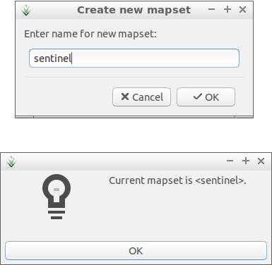
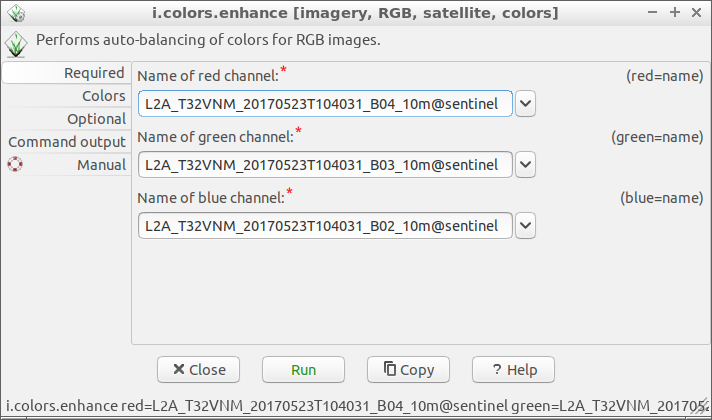

Unit 18 - Sentinel downloader
=============================

There are plenty of libraries or tools which allows downloading
Sentinel products from `Copernicus Open Access Hub
<https://scihub.copernicus.eu/>`__.

For GRASS GIS there is available :grasscmdaddons:`i.sentinel` Addon
extension. It consists of fours GRASS modules:

* :grasscmdaddons:`i.sentinel.download`
* :grasscmdaddons:`i.sentinel.import`
* :grasscmdaddons:`i.sentinel.preproc`
* :grasscmdaddons:`i.sentinel.mask`

.. _grass-addons:

Addons modules are not internal part of GRASS installation but can be
easily installed by :grasscmd:`g.extension` (:menuselection:`Settings
--> Addons extensions --> Install extension from addons`).

.. code-block:: bash

   g.extension extension=i.sentinel

.. figure:: ../images/units/18/g-extension.png

   Install :grasscmdaddons:`i.sentinel` GRASS Addon.

Note that :grasscmdaddons:`i.sentinel.download` requires also
`sentinelsat library <https://pypi.python.org/pypi/sentinelsat>`__ to
be installed.

.. note::

	Sentinelsat is already installed in the :ref:`tailored virtual
	machine <virtual-machine>`. If you need to install it on your
	machine, you can easily do that with
	
	.. code-block:: bash
	
	   pip install sentinelsat
	
	If you have not `pip` command, look `how install it
	<https://pip.pypa.io/en/stable/installing/>`__.

First we are going to create a new mapset (:menuselection:`Settings
--> GRASS working environment --> Create new mapset`) in *oslo-region*
location from :doc:`02` to store all the Sentinel data and start to
work in it.

	
	Create a new mapset for Sentinel data and switch to it.

.. note:: It is possible to create a new mapset and switch to it using
   :grasscmd:`g.mapset` GRASS module.
	
   .. code-block:: bash
	
      g.mapset -c mapset=sentinel

Let's download suitable Sentinel products for our area of interest
(AOI) and perform NDVI calculation as described in :doc:`05`
(implemented as a model in :doc:`08` or as a Python script in
:doc:`11`).

In our case AOI region is defined by Oslo county imported in
:doc:`03`.

Now we can search for suitable Sentinel products. `Sentinel-2 L2A
products
<https://www.sentinel-hub.com/blog/sentinel-2-l2a-products-available-sentinel-hub>`__
will be used to avoid need of computing atmospheric corrections at
this moment. Let's search for latest available product by
:grasscmd:`i.sentinel.download`. At first with :param:`-l` flag given,
just to print results, download procedure will be performed later. In
order to search and download Sentinel products, you have to create an
user account in Copernicus Open Access Hub, see manual page of
:grasscmd:`i.sentinel.download` module for details. Create a new file
:file:`sentinel.txt` containing two lines with your username and
password.

.. note::
	
	To get username and password you need to register to the 
	`Copernicus Open Access Hub <https://scihub.copernicus.eu/>`__,
	see `Register new account <https://scihub.copernicus.eu/dhus/#/self-registration>`__
	page for signing up.
	

.. code-block:: bash

   i.sentinel.download -l map=oslo producttype=S2MSI2Ap settings=sentinel.txt
          
::

   No product found

By default the module returns products for last 60 days. Let's change
search period by :param:`start` and :param:`end` options. To be sure
that our AOI is fully covered by a Sentinel product we also set
:param:`area_relation` option. We can also limit products by
:param:`clouds` coverage percentage threshold.

.. code-block:: bash
                
   i.sentinel.download -l map=oslo producttype=S2MSI2Ap settings=sentinel.txt \
   start=2017-04-01 end=2017-10-01 area_relation=Contains clouds=10

::

   3 Sentinel product(s) found
   2a894e37-1cf5-4bfc-ab42-9e32b99f423f 2017-05-23T10:40:31Z  1% S2MSI2Ap
   71e0c5be-d008-4b71-a8f3-97f4c42ba09a 2017-05-06T10:50:31Z  2% S2MSI2Ap
   74cf18cf-3cae-4d80-b1c8-9f2ee29972b4 2017-05-26T10:50:31Z  4% S2MSI2Ap

.. tip:: If more products have been found you can limit search by
   :param:`limit` option.

Let's download desired product(s). Just remove :param:`-l` flag and
add :param:`output` option in order to define path to output directory
where data should be saved.

.. code-block:: bash
                
   i.sentinel.download map=oslo producttype=S2MSI2Ap settings=sentinel.txt \
   start=2017-01-01 end=2017-10-01 area_relation=Contains clouds=10 limit=1 output=geodata/sentinel/2017

.. note:: Pre-downloaded Sentinel scene is available in sample
   dataset:
   
   :file:`geodata/sentinel/2017/S2A_MSIL2A_20170523T104031_N0205_R008_T32VNM_20170523T104025.SAFE`.
   
.. tip:: Before importing or linking try to print list of filtered
   raster files including projection match (second column 1 for match
   otherwise 0). If projection of input data differs from current
   location consider reprojection (:param:`-r`) or creating a new
   location for import.

   .. code-block:: bash

      i.sentinel.import -p input=geodata/sentinel/2017 pattern="20170523T104031_B0(2|3|4|8)_10m"

   ::

      .../L2A_T32VNM_20170523T104031_B02_10m.jp2 1 (EPSG: 32632)
      ...

In the next step downloaded data can be imported to GRASS by
:grasscmdaddons:`i.sentinel.import`. The command will import **all**
Sentinel bands from :param:`input` directory recursively. Sentinel
bands to be imported can be optionally filtered by :param:`pattern`
option. In example below 2nd, 3rd, 4th and 8th bands in 10m resolution
will be imported. By default input data are imported into GRASS
format, alternatively data can be linked if :param:`-l` is given. It
is also useful to import cloud mask vector features by :param:`-c`
flag.

.. code-block:: bash

   i.sentinel.import -l -c input=geodata/sentinel/2017 pattern="20170523T104031_B0(2|3|4|8)_10m"

RGB composition
---------------

Imported Sentinel bands can be vizualized as a RGB composition. Select
|grass-layer-rgb-add| :sup:`Add RGB map layer` from the Layer Manager.

.. figure:: ../images/units/18/add_rgb.png
   :class: large

   Add RGB map layer.
   
The result appears really dark, see :numref:`rgb-dark-fig`.

.. _rgb-dark-fig:

.. figure:: ../images/units/18/rgb_dark.png
   :class: large

   RGB composition with default grey color table.
    
Color table can be auto-balanced for RGB bands by GRASS module
:grasscmd:`i.color.enhance`. This module modifies the color table of
each image band to provide a more natural color mixture, the base data
remains untouched.

   Auto-balance color table for RGB composition.
   
To see enhanced RGB composition click on |grass-layer-redraw|
:sup:`Render map` in Map Display.

.. figure:: ../images/units/18/rgb_good.png
   :class: large
   
   Enhanced RGB composition.
