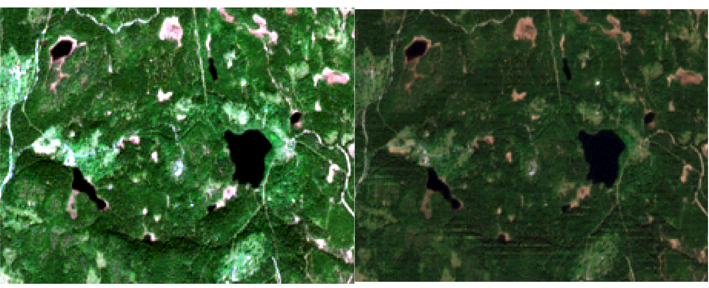

Unit 19 - Sentinel preprocessing
================================
             
In this unit Sentinel-2 L1C (see Sentinel `Product Types
<https://sentinel.esa.int/web/sentinel/user-guides/sentinel-2-msi/product-types>`__
description) data will be preprocessed to be used in GRASS GIS.

In the first step few Sentinal scenes will be downloaded similarly as
shown in :doc:`18`. In this case :param:`producttype=S2MSI2Ap` will be
replaced by :param:`producttype=S2MSI1C`.

.. code-block:: bash

   i.sentinel.download -l map=oslo producttype=S2MSI1C settings=sentinel.txt \
   start=2018-04-01 end=2018-10-01 area_relation=Contains clouds=10

::

   ef0b12ac-9c79-46ec-8223-9655791943ea 2018-05-18T10:40:21Z  0% S2MSI1C
   ...
   97a5820c-c1c8-4300-a076-174c9e7694fa 2018-05-23T10:40:19Z  0% S2MSI1C
   ...
   d6ab2378-84e8-4e73-8be9-0e9833587a65 2018-06-02T10:40:19Z  9% S2MSI1C

Since we already have the Sentinel scene for 23rd May (:doc:`18`) and
5th July 2017 (:doc:`05`) the same dates of 2018 can be downloaded. A
command to download specified scenes by UUID below.

.. code-block:: bash

   i.sentinel.download settings=sentinel.txt output=geodata/sentinel/2018 \
   uuid=97a5820c-c1c8-4300-a076-174c9e7694fa

In the next step downloaded data are imported into GRASS GIS using
another command provided by :grasscmd:`i.sentinel` addons,
:grasscmd:`i.sentinel.preproc`.  This module requires some inputs used
to perform the atmospheric correction of Sentinel-2 images.

As elevetion model DMT imported in :ref:`Unit 17 <dmt-comparision>`
can be used. What we need to obtain yet is a visibility map or an
Aerosol Optical Depth (AOD) value, the second one is possible to
get from `http://aeronet.gsfc.nasa.gov
<http://aeronet.gsfc.nasa.gov/cgi-bin/webtool_opera_v2_inv>`__.

First you have to select a station close to your Sentinel-2 scene
area. In our case Birkenes, click on download, see
:numref:`aeronet-station-fig`.

.. _aeronet-station-fig:

.. figure:: ../images/units/19/aeronet_station.png

   Download Aeronet station data.
   
Now tick the box near the bottom labelled as 'Combined file (all
products without phase functions)'.

.. figure:: ../images/units/19/aeronet_download.png

   Combined file requested.
   
Last step is to accept the license (:wikipedia:`Public domain` data).

Once we have downloaded Sentinel and AOD data we need to decompress
them (it is possible to find already the AOD file in :file:`~/geodata/sentinel/2018/`).

.. code-block:: bash

   cd ~/geodata/sentinel/2018/
   unzip S2B_MSIL1C_20180523T104019_N0206_R008_T32VNM_20180523T142657.zip

Now we are ready to import the data with :grasscmd:`i.sentinel.preproc`.

.. code-block:: bash

   i.sentinel.preproc -a -t \
   input_dir=~/geodata/sentinel/S2B_MSIL1C_20180523T104019_N0206_R008_T32VNM_20180523T142657.SAFE \
   elevation=DTM_patch atmospheric_model=Automatic aerosol_model="Continental model" \
   aeronet_file=~/geodata/sentinel/2018/180501_180531_Birkenes.dubovik suffix=cor \ 
   text_file=~/geodata/sentinel/S2B_MSIL1C_20180523T104019_N0206_R008_T32VNM_20180523T142657.SAFE/mask.txt

.. note:: In our case DTM from :ref:`Unit 17 <dtm-patch-section>` or
   EU-DEM from :doc:`15` can be used. In both cases the data needs to
   be reprojected into *sentinel* mapset, see :ref:`How-to reproject data
   <data-reproject-fig>` section for details.

The :param:`-a` flag is needed since we use AOD file, :param:`-t` is used
to write a text file (:param:`text_file`) ready to be used as input for
the next step, creating cloud mask by :grasscmd:`i.sentinel.mask`.

Set the region based on `DTM_patched` and resolution 10 meter

.. code-block:: bash

   g.region raster=DTM_patch res=10 -ap

:grasscmd:`i.sentinel.mask` creates clouds and cloud shadows masks for
Sentinel-2 images, the algorithm has been developed starting from
rules found in literature (Parmes et. al 2017) and conveniently
refined.

.. code-block:: bash

   i.sentinel.mask -r cloud_mask=T32VNM_20180523T104019_cloud shadow_mask=T32VNM_20180523T104019_shadow \
   cloud_threshold=25000 shadow_threshold=5000 \
   input_file=~/geodata/sentinel/S2B_MSIL1C_20180523T104019_N0206_R008_T32VNM_20180523T142657.SAFE/mask.txt \
   mtd_file=~/geodata/sentinel/S2B_MSIL1C_20180523T104019_N0206_R008_T32VNM_20180523T142657.SAFE/MTD_MSIL1C.xml
   
In the last step topographic correction of reflectance must be
performed in order to use Sentinel data for analysis. Required sun
position for a given date is computed by :grasscmd:`r.sunmask`.

.. code-block:: bash

   r.sunmask -gs dtm_oslo year=2018 month=5 day=23 hour=10 minute=40 timezone=0
   
::

   Using map center coordinates: 250000.000000 6675000.000000
   ...
   sunazimuth=167.292191
   sunangleabovehorizon=50.010803
   sunrise=02:31:19
   sunset=19:58:34

The :grasscmd:`r.sunmask` output is returning the sun angle above the horizont
(h), instead we need the zenith (z). So we need to do a simple substraction

.. code-block:: math

   z = 90 - h

In our example the zenith value is 39.99 

.. figure:: ../images/units/19/i_topo_corr_angles.png

   Figure showing terrain and solar angles.
   Derived from Neteler & Mitasova, 2008. 

Now we have to run :grasscmd:`i.topo.corr` to calculate an
illumination model from the elevation map, and finally correct the
bands. Pay attention that :grasscmd:`i.topo.corr` requires DCELL
(double) raster type so before running :grasscmd:`i.topo.corr` raster
type conversion is required. To convert all the maps a sample Python
code below can be used.

.. code-block:: python

   from grass.pygrass.gis import Mapset   
   from grass.pygrass.modules import Module

   mapset = Mapset()
   mapset.current()

   # make a for loop for each Sentinel band
   for rast in mapset.glist("raster", pattern="T32VNM_20180523T104019_B*_cor")
       # set compupational region region 
       Module("g.region", raster=rast)
       # convert the data
       Module("r.mapcalc", expression="{r}_d=double({r})".format(r=rast)

.. code-block:: bash

   i.topo.corr -i base=DTM_patch zenith=39.99 azimuth=167.292191 output=dtm_illu
   
.. code-block:: bash

   i.topo.corr base=dtm_illu input=T32VNM_20180523T104019_B08_cor_d,\
   T32VNM_20180523T104019_B02_cor_d,T32VNM_20180523T104019_B03_cor_d,T32VNM_20180523T104019_B04_cor_d \
   output=tcor zenith=39.99 method=c-factor

   In the left the original RGB data improved using :grasscmd:`i.color.enhance`,
   in the right the RGB of topographic corrected bands

.. tip::
   
   To visualize RGB images read the note at :ref:`Unit 03 <rgb_bands>`.
   To create the previous RGB rast maps, :grasscmd:`r.composite` was used.
