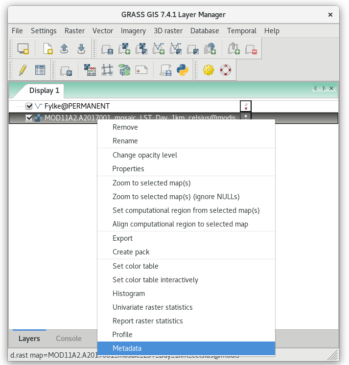
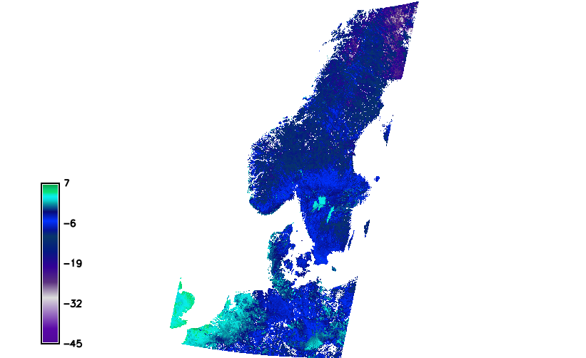

Unit 20 - MODIS LST
===================

There are two satellites, Aqua and Terra which carry the MODIS sensor
as payload. The **Moderate Resolution Imaging Spectroradiometer**
(:wikipedia:`MODIS`) is a 36-channel from visible to thermal-infrared
sensor that was launched as part of the Terra satellite payload in
December 1999 and Aqua satellite (May 2002). The Terra satellite
passes twice a day (at about 10:30am, and 22:30pm local time), also
the Aqua satellite passes twice a day (at about 01:30am, and 13:30pm
local time). (source: `GRASS Wiki
<https://grasswiki.osgeo.org/wiki/MODIS>`__)

Our area of interest, Norway, is covered by two tiles (see `MODLAND
grid <https://modis-land.gsfc.nasa.gov/MODLAND_grid.html>`__):

* h18v02
* h18v03

Download and import
-------------------

Create a new GRASS mapset (see :ref:`how-to
<work-organization-section>`) called `modis` in location *oslo-region*
from :doc:`02` and install :grasscmdaddons:`i.modis` addons extension
(more about installing addons in :ref:`Unit 18 <grass-addons>`) for
downloading and importing MODIS data (note that you have to install
also `pyMODIS Python Library <http://www.pymodis.org/>`__).

.. code-block:: bash

   pip install pymodis
   g.extension extension=i.modis

.. note:: :grasscmd:`i.modis` including dependecies is already
   installed on tailored :ref:`virtual machine <virtual-machine>`.

GRASS MODIS addon consists of two modules:

* :grasscmdaddons:`i.modis.download`
* :grasscmdaddons:`i.modis.import`

Let's download desired tiles (h18v02 and h18v03) for year 2017 by
:grasscmdaddons:`i.modis.download`. We are interested about LST
products (both Aqua and Terra satellites).

.. note:: Already downloaded MODIS can be found in sample dataset in
   :file:`modis/h18v02_03` folder.
          
.. code-block:: bash

   i.modis.download settings=modis.txt folder=geodata/modis/h18v02_03 \
   tiles=h18v02,h18v03 product=lst_aqua_eight_1000,lst_terra_eight_1000 \
   startday=2017-01-01 endday=2018-01-01

.. note:: Output folder (:file:`geodata/modis` in this case) must exists,
   otherwise the module will fail.
             
   File :file:`settings.txt` contains two lines: *username* and
   *password* for accessing MODIS download service.
   
   Please read carefully how to register and set up your account on
   `pyModis documentation
   <http://www.pymodis.org/info.html#user-and-password>`__.

Data are imported by :grasscmdaddons:`i.modis.import` including
reprojection into target location.

.. _modis-import:

.. code-block:: bash

   i.modis.import -mw files=geodata/modis/h18v02_03/listfileMOD11A2.006.txt \
   spectral='( 1 0 0 0 1 0 0 0 0 0 0 0 )' outfile=geodata/modis/tlist-mod.txt

   i.modis.import -mw files=geodata/modis/h18v02_03/listfileMYD11A2.006.txt \
   spectral='( 1 0 0 0 1 0 0 0 0 0 0 0 )' outfile=geodata/modis/tlist-myd.txt

If ``-m`` flag is given mosaics from input tiles is created
automatically, see :numref:`modis-mosaics`.

.. note:: The command was run twice, once for Aqua data than for Terra
          data.

.. _modis-mosaics:

.. figure:: ../images/units/20/modis-mosaics.png
   :class: large
        
   Mosaics created from h18v02 and h18v03 tiles.

.. _modis-lst:
   
LST
---

In this section **Land Surface Temperature** (LST) analysis will be
perfmored for Norway. 

Mask based on Norway administrate border is set by :grasscmd:`r.mask`
based on data imported in :ref:`Unit 03
<import-vector-section>`. Don't forget that a mask is created in the
current computation region. Computation extent needs to be set based
on :map:`Fylke` vector map and computational grid aligned input data
by :grasscmd:`g.region`.

.. code-block:: bash

   g.region vector=Fylke align=MOD11A2.A2017001_mosaic_LST_Day_1km
   r.mask vector=Fylke

Let's check range values of our LST data (by :grasscmd:`r.info` module
or from Layer Manager).

   Raster map metadata.
          
.. code-block:: bash

   r.info -r map=MOD11A2.A2017001_mosaic_LST_Day_1km

::

  min=0
  max=14015    

.. _modis-dn-c:
  
The values do not appear to be temperature. In order to determine LST
from input data, digital values (DN) must be converted into Celsius or
Kelvin scale.

.. math::

   C = DN * 0.02 - 273.15

Conversion to Celsium scale can be done by :grasscmd:`r.mapcalc` (see
:doc:`05` for basic information about map algebra in GRASS). It's also
suitable to replace zero values with no-data value (NULL values in
GRASS terminology).

Example (replace :map:`tile` with real map name):
   
.. code-block:: bash
                
   r.mapcalc expression="MOD11A2.A2017001_mosaic_LST_Day_1km_celsius = \
   if(MOD11A2.A2017001_mosaic_LST_Day_1km != 0, MOD11A2.A2017001_mosaic_LST_Day_1km * 0.02 - 273.15, null())"

Let's check range values of new LST data

.. code-block:: bash

   r.info -r map=MOD11A2.A2017001_mosaic_LST_Day_1km_celsius

::

   min=-45.09
   max=6.05000000000001

        
   LST reconstruction for Norway in Celsius scale (color table
   ``celsius`` applied).
