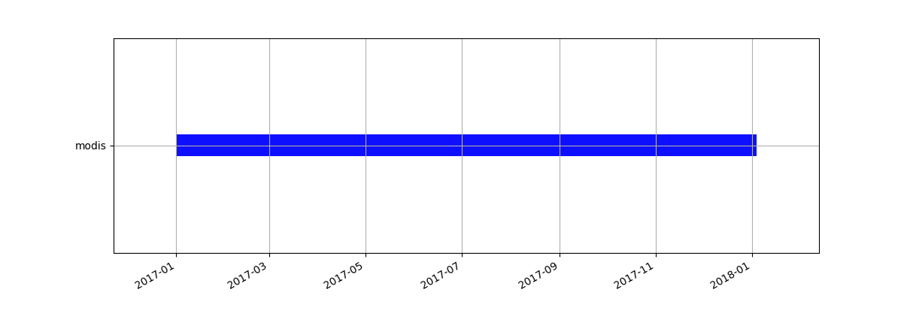

Unit 21 - Spatio-temporal intro
===============================

GRASS GIS 7 comes with high quality and flexibility tools for
spatio-temporal data processing, see :grasscmd:`GRASS documentation
<temporalintro>` for details. All GRASS modules from spatio-temporal
framework start with ``t.*`` prefix.

GRASS introduces three special datatypes that are designed to handle
time series data:

* *Space time raster datasets* (``strds``) for managing raster map
  time series.
* *Space time 3D raster datasets* (``str3ds``) for managing 3D raster
  map time series.
* *Space time vector datasets* (``stvds``) for managing vector map time
  series.
            
Spatio-temporal MODIS data
--------------------------

..
  The first step to work with the spatio-temporal framework is to
  connect a space-time database by :grasscmd:`t.connect`. Default
  settings is forced by :param:`-d` flag.
  .. code-block:: bash

  t.connect -d

A new space time raster datasets is created by :grasscmd:`t.create`.

.. code-block:: bash

   t.create output=modis title="MODIS 2017" desc="MODIS data for Norway"

In the next step register to the dataset imported MODIS data from
:ref:`Unit 20 <modis-import>` by :grasscmd:`t.register`. Note that
:grasscmdaddons:`i.modis.import` in :doc:`20` was called with
:param:`-w` flag and :param:`outfile` parameter to generate special
file which can be later used for creating space-time raster dataset
(strds). The command needs to be run twice, once for Aqua data than
for Terra data.

.. code-block:: bash

   t.register input=modis file=geodata/modis/tlist-mod.txt
   t.register input=modis file=geodata/modis/tlist-myd.txt

Let's check basic metedata about created dataset by
:grasscmd:`t.info`.

.. code-block:: bash

   t.info input=modis

::

   ...
   | Start time:................. 2017-01-01 00:00:00
   | End time:................... 2018-01-04 00:00:00
   | Granularity:................ 8 days
   | Temporal type of maps:...... interval
   ...
   | Number of registered maps:.. 184

.. _t-register-file:

.. note:: See granularity. In this case a composed product from the
   daily 1-kilometer LST product (MOD11A1/MYD11A1) stored on a 1-km
   Sinusoidal grid as the average values of clear-sky LSTs during an
   8-day period is used.

   ::

      MOD11A2.A2017297_mosaic_LST_Day_1km|2017-10-24|2017-11-01
    
Time topology information can be obtained by :grasscmd:`t.topology`.

.. code-block:: bash

   t.topology input=modis

::

   ...
   +-------------------- Temporal topology -------------------------------------+
   | Is subset of dataset: ...... False
   | Temporal topology is: ...... invalid
   | Number of intervals: ....... 184
   | Invalid time stamps: ....... 0
   | Number of points: .......... 0
   | Number of gaps: ............ 0
   | Granularity: ............... 8 days
   ...

.. _g-gui-timeline:

It is possible to see our spatio-temporal dataset also graphically
using :grasscmd:`g.gui.timeline` (:menuselection:`Temporal --> GUI
tools --> Timeline tool`).

   Download MODIS data presented by Timeline tool.
   
Data querying
-------------

List of registered raster maps in spatio-temporal dataset can be
printed by :grasscmd:`t.rast.list`.

.. code-block:: bash

   t.rast.list input=modis order=start_time

::

   name|mapset|start_time|end_time
   MOD11A2.A2017001_mosaic_LST_Day_1km|modis|2017-01-01 00:00:00|2017-01-09 00:00:00
   MOD11A2.A2017001_mosaic_LST_Night_1km|modis|2017-01-01 00:00:00|2017-01-09 00:00:00
   MYD11A2.A2017001_mosaic_LST_Day_1km|modis|2017-01-01 00:00:00|2017-01-09 00:00:00
   MYD11A2.A2017001_mosaic_LST_Night_1km|modis|2017-01-01 00:00:00|2017-01-09 00:00:00
   ...
   MOD11A2.A2017361_mosaic_LST_Day_1km|modis|2017-12-27 00:00:00|2018-01-04 00:00:00
   MOD11A2.A2017361_mosaic_LST_Night_1km|modis|2017-12-27 00:00:00|2018-01-04 00:00:00
   MYD11A2.A2017361_mosaic_LST_Day_1km|modis|2017-12-27 00:00:00|2018-01-04 00:00:00
   MYD11A2.A2017361_mosaic_LST_Night_1km|modis|2017-12-27 00:00:00|2018-01-04 00:00:00

Printed maps can be filtered by various parameters. In the example
below are printed raster maps with data covering March 2017 only.

.. code-block:: bash

   t.rast.list input=modis order=start_time \
   where="start_time > '2017-03-01' and start_time < '2017-04-01'"
   # or
   t.rast.list input=modis order=start_time \
   where="strftime('%m', start_time)='03'"

::

   name|mapset|start_time|end_time
   MOD11A2.A2017065_mosaic_LST_Day_1km|modis|2017-03-06 00:00:00|2017-03-14 00:00:00
   MOD11A2.A2017065_mosaic_LST_Night_1km|modis|2017-03-06 00:00:00|2017-03-14 00:00:00
   MYD11A2.A2017065_mosaic_LST_Day_1km|modis|2017-03-06 00:00:00|2017-03-14 00:00:00
   MYD11A2.A2017065_mosaic_LST_Night_1km|modis|2017-03-06 00:00:00|2017-03-14 00:00:00
   ...
   MOD11A2.A2017089_mosaic_LST_Day_1km|modis|2017-03-30 00:00:00|2017-04-07 00:00:00
   MOD11A2.A2017089_mosaic_LST_Night_1km|modis|2017-03-30 00:00:00|2017-04-07 00:00:00
   MYD11A2.A2017089_mosaic_LST_Day_1km|modis|2017-03-30 00:00:00|2017-04-07 00:00:00
   MYD11A2.A2017089_mosaic_LST_Night_1km|modis|2017-03-30 00:00:00|2017-04-07 00:00:00

In the next example only raster maps coming from Aqua satellite are
printed.

.. code-block:: bash

   t.rast.list input=modis order=start_time where="name LIKE 'MYD%'"

::

   name|mapset|start_time|end_time
   MYD11A2.A2017001_mosaic_LST_Day_1km|modis|2017-01-01 00:00:00|2017-01-09 00:00:00
   MYD11A2.A2017001_mosaic_LST_Night_1km|modis|2017-01-01 00:00:00|2017-01-09 00:00:00
   MYD11A2.A2017009_mosaic_LST_Day_1km|modis|2017-01-09 00:00:00|2017-01-17 00:00:00
   MYD11A2.A2017009_mosaic_LST_Night_1km|modis|2017-01-09 00:00:00|2017-01-17 00:00:00
   ...
   MYD11A2.A2017353_mosaic_LST_Day_1km|modis|2017-12-19 00:00:00|2017-12-27 00:00:00
   MYD11A2.A2017353_mosaic_LST_Night_1km|modis|2017-12-19 00:00:00|2017-12-27 00:00:00
   MYD11A2.A2017361_mosaic_LST_Day_1km|modis|2017-12-27 00:00:00|2018-01-04 00:00:00
   MYD11A2.A2017361_mosaic_LST_Night_1km|modis|2017-12-27 00:00:00|2018-01-04 00:00:00

Univariate statistics can be calculated by :grasscmd:`t.rast.univar`.
In example below statistics only for March 2017 is calculated.

.. code-block:: bash

   t.rast.univar input=modis where="start_time > '2017-03-01' and start_time < '2017-04-01'"

::

   id|start|end|mean|min|max|mean_of_abs|stddev|variance|coeff_var|sum|null_cells|cells
   MOD11A2.A2017065_mosaic_LST_Day_1km@modis|2017-03-06 00:00:00|2017-03-14 00:00:00|...
   MOD11A2.A2017065_mosaic_LST_Night_1km@modis|2017-03-06 00:00:00|2017-03-14 00:00:00|...
   MYD11A2.A2017065_mosaic_LST_Day_1km@modis|2017-03-06 00:00:00|2017-03-14 00:00:00|...
   MYD11A2.A2017065_mosaic_LST_Night_1km@modis|2017-03-06 00:00:00|2017-03-14 00:00:00|...

Data extracting
---------------

Raster spatio-temporal data can be extracted into new dataset using
:grasscmd:`t.rast.extract`. In the example below are created four new
datasets containing data of different satellite and datetime.

.. code-block:: bash

   t.rast.extract input=modis where="name LIKE 'MOD%LST_Day_1km'" output=modis_terra_day
   t.rast.extract input=modis where="name LIKE 'MOD%LST_Night_1km'" output=modis_terra_night
   t.rast.extract input=modis where="name LIKE 'MYD%LST_Day_1km'" output=modis_aqua_day
   t.rast.extract input=modis where="name LIKE 'MYD%LST_Night_1km'" output=modis_aqua_night

At this point we can check the basic information

.. code-block:: bash

   t.info input=modis_terra_day

::

   ...
   | Start time:................. 2017-01-01 00:00:00
   | End time:................... 2018-01-04 00:00:00
   | Granularity:................ 8 days
   | Temporal type of maps:...... interval
   ...
   | Number of registered maps:.. 46
   ...

and later time topology which should be valid compared to original
dataset.

.. code-block:: bash

   t.topology input=modis_terra_day

::

   ...
   | Temporal topology is: ...... valid
   | Number of intervals: ....... 46
   | Invalid time stamps: ....... 0
   | Number of points: .......... 0
   | Number of gaps: ............ 0
   | Granularity: ............... 8 days
   ...
