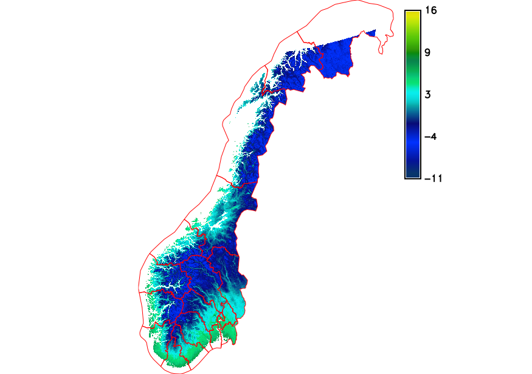
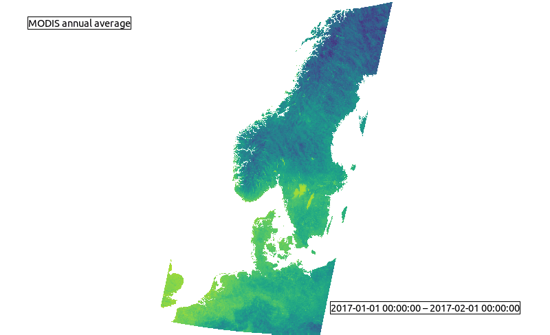
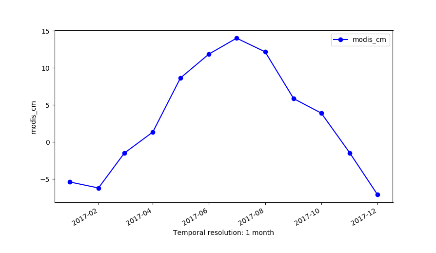

Unit 22 - Spatio-temporal basic analysis
=========================================

Map algebra
------------

As we can see we have to convert DN into Celsius scale as we done for selected
data in :ref:`Unit 24 <modis-dn-c>`. Instead of running :grasscmd:`r.mapcalc`
we can use temporal command :grasscmd:`t.rast.mapcalc` which applies map algebra
to all the maps registered in input space time dataset.

.. tip::

   Many of temporal data processing modules (t.*) support parallelization (see nproc option).
   
.. code-block:: bash

   t.rast.mapcalc input=modis output=modis_c nproc=3 basename=modis_celsius \
   expression="if(modis != 0, modis * 0.02 - 273.15, null())"

.. note::

   In the expression we need to set the Spatio-temporal dataset name instead
   of the raster maps name.

Alternatively, we could have used :grasscmd:`t.rast.algebra` to perform the
previous transformation. The command would look like this:

.. code-block:: bash

   t.rast.algebra basename=modis_celsius expression="modis_c = modis * 0.02 - 273.15"

We can easily set the color table for all the maps in a spatial-temporal
raster dataset by :grasscmd:`t.rast.colors` similarly as :grasscmd:`r.colors`
does for single raster map.

.. code-block:: bash

   t.rast.colors input=modis_c color=celsius 

Data aggregation
----------------

The temporal framework enable the user to do data aggregation in a really
simple way. The command to use is :grasscmd:`t.rast.aggregate`. You have just
to choose the desidered :param:`granularity` and it will create the new
temporal dataset

.. code-block:: bash
                          
   t.rast.aggregate input=modis_c output=modis_cm basename=cm granularity="1 months" nproc=3

Statistics can be computed by :grasscmd:`t.rast.univar`.

.. code-block:: bash
                
   t.rast.univar modis_cm

Another aggregations method is :grasscmd:`t.rast.series`, it  allows us to
aggregate our STRDS or parts of it with different methods. It return a map
as output and not a temporal dataset as :grasscmd:`t.rast.aggregate`.
We will compute annual average temperature.

.. code-block:: bash
                
   t.rast.series input=modis_c output=modis_avg method=average

Four new raster maps are created, let's print univariate statistics
for spring by using :grasscmd:`r.univar`.
   
.. code-block:: bash

   r.univar modis_avg

::

   minimum: -11.0865
   maximum: 16.085
   range: 27.1715
   mean: 3.39483

   Average temperature for 2017.

Data visualization
------------------

In addition to :grasscmd:`g.gui.timeline` there are other two GRASS tools
for temporal data visualization: :grasscmd:`g.gui.animation` and
:grasscmd:`g.gui.tplot`.

:grasscmd:`g.gui.animation` permit to the user to create animations and export
them in different format, the example below show the monthly average

.. code-block:: bash

   g.gui.animation strds=modis_cm

   Monthly average dataset animation.

The other tool, :grasscmd:`g.gui.tplot`, offer us to plot the time series
of our variable of interest for a specific point or area of your study region.
With point you need to set the strds or stvds and a pair of X,Y coordinates.

.. code-block:: bash

   g.gui.tplot strds=modis_c coordinates=258121.68627886,6662114.92897065
   

   The plot of MODIS monthly average @ Studenterhytta
