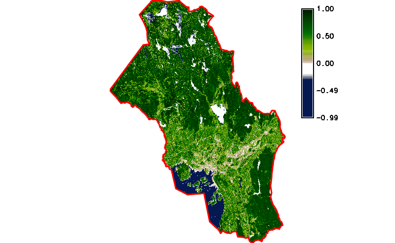
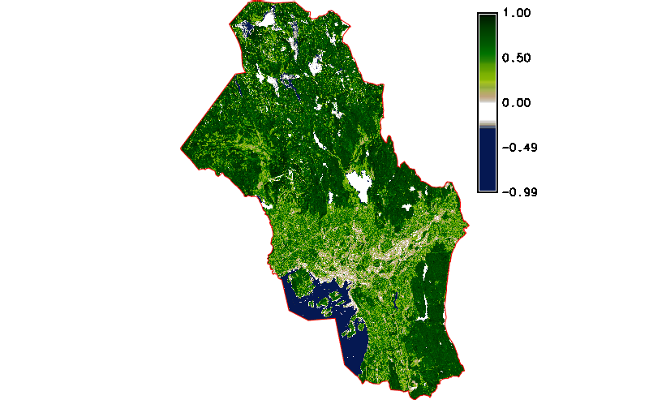

Unit 23 - Spatio-temporal NDVI computation
==========================================

Create a new mapset in *oslo-region* location, eg. *sentinel-st-ndvi*,
see :ref:`Work organization <work-organization-section>` section.

Let's download Sentinel L2A products for spring/summer
2017/2018. There are 4 products available as shown below. Note that in
given period there are no Sentinel L2A products for 2018.

.. code-block:: bash
                
   i.sentinel.download -l settings=sentinel.txt map=oslo area_relation=Contains \
   start=2017-04-01 end=2017-10-01 producttype=S2MSI2A

::
   
   2a894e37-1cf5-4bfc-ab42-9e32b99f423f 2017-05-23T10:40:31Z  1% S2MSI2Ap
   71e0c5be-d008-4b71-a8f3-97f4c42ba09a 2017-05-06T10:50:31Z  2% S2MSI2Ap
   74cf18cf-3cae-4d80-b1c8-9f2ee29972b4 2017-05-26T10:50:31Z  4% S2MSI2Ap
   06724aba-9269-492c-a1d5-208a06c3f282 2017-07-05T10:50:31Z 27% S2MSI2Ap

Download selected Sentinel scenes:

.. code-block:: bash
                
   i.sentinel.download settings=sentinel.txt map=oslo area_relation=Contains \
   start=2017-05-01 end=2017-10-01 producttype=S2MSI2Ap output=geodata/sentinel/2017
   
.. note:: Pre-downloaded Sentinel scenes are available in sample
   dataset :file:`geodata/sentinel/2017`.

Data are imported by :grasscmd:`i.sentinel.import` similarly as done
in :doc:`18`. At fisrt check list of bands to be imported by
:param:`-p` flag. Since we are going to compute NDVI only 4th and 8th
band are selected.

.. code-block:: bash

   i.sentinel.import -p input=geodata/sentinel/2017 pattern="B0(4|8)_10m"
   
   i.sentinel.import -l -c input=geodata/sentinel/2017 pattern="B0(4|8)_10m"

.. _sentinel-go-to:

In next step a new space time raster dataset will be created and
imported maps registered. Unfortunately there are no timestamps for
imported maps required by :grasscmd:`t.register` as shown in
:ref:`Unit 21 <t-register-file>`. For this purpose a simple Python
script has been designed.

.. literalinclude:: ../_static/scripts/sentinel-timestamp.py
   :language: python
   :linenos:
   :emphasize-lines: 27, 30

Timestamps can be easily determined from raster map name, for example
*L2A_T32UPB_20170517T102031_B04_10m* raster map will be timestamped by
*2017-05-17 10:20:31*, see line :lcode:`30`.

.. note:: To avoid error in computation we also set up endtime
   timestamp as starttime+1sec, see :lcode:`27`.

.. todo:: This workaround should be avoided. Determine how?

Sample script to download: `sentinel-timestamp.py
<../_static/scripts/sentinel-timestamp.py>`__

By running this script a timestamp file will be produced.

.. code-block:: bash

   sentinel-timestamp.py output=sentinel-timestamps.txt

Example of created timestamps file show below.

::

   L2A_T32VNM_20170523T104031_B04_10m|2017-05-23 10:40:31|2017-05-23 10:40:32
   L2A_T32VNM_20170506T105031_B08_10m|2017-05-06 10:50:31|2017-05-06 10:50:32
   L2A_T32VNM_20170526T105031_B04_10m|2017-05-26 10:50:31|2017-05-26 10:50:32
   ...

At this moment a new space time dataset can be created by
:grasscmd:`t.create` and all imported Sentinel bands registered by
:grasscmd:`t.register`.

.. code-block:: bash

   t.create output=sentinel2017 title="Sentinel L2A 2017" desc="Oslo region NDVI computation"
   t.register input=sentinel2017 file=sentinel-timestamps.txt

Let's check basic metadata (:grasscmd:`t.info`) and list of registered
maps (:grasscmd:`t.rast.list`).

.. code-block:: bash

   t.info input=sentinel2017

::

   ...
   | Start time:................. 2017-05-06 10:50:31
   | End time:................... 2017-07-05 10:50:32
   ...
   | Number of registered maps:.. 8

.. code-block:: bash
                
   t.rast.list input=sentinel2017

::

   name|mapset|start_time|end_time
   L2A_T32VNM_20170506T105031_B04_10m|sentinel-st-ndvi|2017-05-06 10:50:31|2017-05-06 10:50:32
   L2A_T32VNM_20170506T105031_B08_10m|sentinel-st-ndvi|2017-05-06 10:50:31|2017-05-06 10:50:32
   L2A_T32VNM_20170523T104031_B04_10m|sentinel-st-ndvi|2017-05-23 10:40:31|2017-05-23 10:40:32

NDVI ST computation
-------------------

For NDVI computation 4th and 8th bands are required (:doc:`05`). Map
algebra is performed in the case of spatio-temporal data by
:grasscmd:`t.rast.mapcalc` which requires data separated into
spatio-temporal datasets (see example in :doc:`22`). Such datasets can
be prepared by :grasscmd:`t.rast.extract`.

.. code-block:: bash

   t.rast.extract input=sentinel2017 where="name like '%B04%'" output=b4
   t.rast.extract input=sentinel2017 where="name like '%B08%'" output=b8

Let's check content of the new datasets by :grasscmd:`t.rast.list`.

.. code-block:: bash

   t.rast.list input=b4
   t.rast.list input=b8

Set computational region by :grasscmd:`g.region` including mask for
area of interest by :grasscmd:`r.mask`.

.. code-block:: bash

   g.region vector=oslo align=L2A_T32VNM_20170506T105031_B04_10m
   r.mask vector=oslo

NDVI computation on spatio-temporal datasets can be performed in
parallel (:param:`nproc`).

.. code-block:: bash

   t.rast.mapcalc input=b4,b8 output=ndvi expression="ndvi = float(b8 - b4) / ( b8 + b4 )" \
   basename=ndvi nproc=3

When computation is finished *ndvi* color table can be by
:grasscmd:`t.rast.colors`.

.. code-block:: bash

   t.rast.colors input=ndvi color=ndvi

   Simple NDVI animation (no cloud mask applied) created by
   :grasscmd:`g.gui.animation`.

.. note:: Load data as multiple raster maps instead of space time
          dataset. There is problem with sampling related to trick
          with endtime mentioned above.

Cloud mask
^^^^^^^^^^

The result is not perfect enough. At least cloud mask should be
applied before NDVI computation. This operation can be easily solved
by applying new space time dataset containing computed raster masks. A
sample Python script has been designed for this purpose below. The
script also produces a timestamp file similarly to
:file:`sentinel-timestamp.py`. Such mask can be created by
:grasscmd:`r.mask`, see line :lcode:`30`. But in this case a mask
should be kept for further usage. Note that :grasscmd:`r.mask` module
produces normal raster map with unique name *MASK*. To disable mask it
is enough to rename *MASK* map by :grasscmd:`g.rename`, see line
:lcode:`43`.

.. literalinclude:: ../_static/scripts/sentinel-clouds-mask.py
   :language: python
   :linenos:
   :emphasize-lines: 30, 43

Sample script to download: `sentinel-cloud-mask.py
<../_static/scripts/sentinel-cloud-mask.py>`__
	     
.. code-block:: bash
		
   sentinel-cloud-mask.py map=oslo output=cloud-timestamps.txt

Now we can create a new space time dataset with raster cloud masks
registered.

.. code-block:: bash

   t.create output=cloud title="Sentinel L2A 2017 (cloud)" desc="Oslo region"
   t.register input=cloud file=cloud-timestamps.txt

And apply modified expression for map algebra.

.. code-block:: bash

   t.rast.mapcalc input=b4,b8,cloud output=ndvi_cloud \
   expression="ndvi = if(isnull(cloud), null(), float(b8 - b4) / ( b8 + b4 ))" \
   basename=ndvi_cloud nproc=3

   t.rast.colors input=ndvi_cloud color=ndvi

   Simple NDVI animation with cloud mask applied.

   
