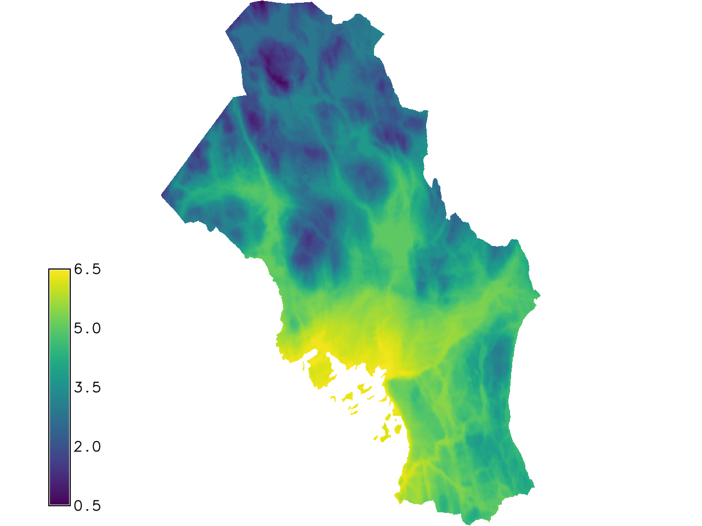
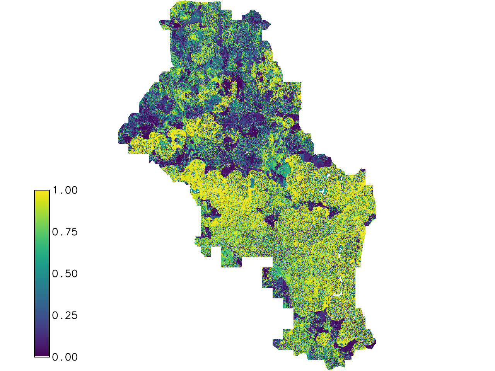

Unit 27 - Regression analysis
=============================

GRASS GIS comes with different modules performing regression
analysis. These modules work with single raster map or with time
series data too. There are two core GRASS modules related to
regression: :grasscmd:`r.regression.line` and
:grasscmd:`r.regression.multi`. There are also other interesting
modules distributed as addons which will be demostrated in this unit.

r.regression.line
-----------------

:grasscmd:`r.regression.line` calculates a linear regression from two
raster maps, according to the formula `y = a + b*x`. It also returns
some regression coefficients like offset/intercept (a), gain/slope
(b), correlation coefficient (R), number of elements (N), means (medX,
medY), standard deviations (sdX, sdY), and the F test for testing the
significance of the regression model as a whole (F); these parameters
could be saved in a text file.

.. code-block:: bash

   r.regression.line mapx=dtm mapy=modis_avg
   
::

   y = a + b*x
   a (Offset): 6.534392
   b (Gain): -0.009867
   R (sumXY - sumX*sumY/N): -0.862133
   N (Number of elements): 718021
   F (F-test significance): 2078811.252064
   meanX (Mean of map1): 269.004369
   sdX (Standard deviation of map1): 129.487450
   meanY (Mean of map2): 3.880192
   sdY (Standard deviation of map2): 1.481930

It is possible to apply the model variable with the predictor

.. code-block:: bash

   r.mapcalc expression="temp_linear = 6.534392 + -0.0096867 * dtm"

   Model example.

.. tip::

   In Linux Bash :program:`eval` command allows to store an output of
   GRASS GIS modules called with :param:`-g` flag as environmental
   variables which can be reused afterwards by other GRASS modules,
   see example below.
   
   .. code-block:: bash
   
      r.regression.line -g mapx=dtm mapy=modis_avg
      r.mapcalc expression="temp_linear = $a + $b * dtm"

r.regression.multi
------------------

The :grasscmd:`r.regression.multi` calculates a multiple linear
regression from raster maps according to the formula `Y = b0 +
sum(bi*Xi) + E`. Two output maps are returned, one for residuals and
one for estimates plus all the regression coefficients.

Create a map with maximum NDVI value from spatio-temporal dataset
created in :doc:`23` by :grasscmd:`t.rast.series`.

.. code-block:: bash

   g.region vector=oslo align=L2A_T32VNM_20170506T105031_B04_10m                
   t.rast.series input=ndvi_cloud method=maximum output=ndvi_max

And now use the maximum NDVI map as one of the input coefficients. 

.. code-block:: bash

   r.regression.multi mapx=dtm,ndvi_max mapy=modis_avg residuals=resi estimates=esti -g

::

   n=4353047
   Rsq=0.749059
   Rsqadj=0.749059
   RMSE=0.746155
   MAE=0.593534
   F=6496914.853654
   b0=6.792572
   AIC=-2549329.836898
   AICc=-2549329.836898
   BIC=-2549289.977738

   predictor1=dtm
   b1=-0.009514
   Rsq1=0.583921
   F1=10129206.204638
   AIC1=2683241.367502
   AICc1=2683241.367502
   BIC1=2683252.653888

   predictor2=ndvi_max
   b2=-0.497951
   Rsq2=0.006463
   F2=112121.300410
   AIC2=-2438630.088387
   AICc2=-2438630.088387
   BIC2=-2438618.802001

.. figure:: ../images/units/27/estimates_multi.png

   The estimates output by :grasscmd:`r.regression.multi`.

.. tip::

   It is possible to calculate differences between original LST data
   and the output of the models with :grasscmd:`r.mapcalc`.

r.gwr
-----

There two GRASS Addons modules related to regression analysis:
:grasscmdaddons:`r.gwr` and :grasscmdaddons:`r.regression.series`.

:grasscmdaddons:`r.gwr` calculates geographically weighted regression
from raster maps, it resolves a formula `Y = b0 + sum(bi*Xi) + E`. The
formula is applied in a moving window. Cells closer to the center of
the moving window get a higher weight. :grasscmdaddons:`r.gwr` is more
an analytical tool to test if the predictors are suitable for a global
model applied by :grasscmd:`r.regression.multi`.

.. code-block:: bash

   r.gwr mapx=dem,ndvi_max mapy=modis_avg residuals=resi_gwr estimates=esti_gwr -g

::

   n=4321368
   Rsq=0.997701
   Rsqadj=0.997701
   F=9.37847e+08
   bmean0=-4.35557
   bstddev0=2863.45
   bmin0=-3.58167e+06
   bmax0=495224
   AIC=-2.27972e+07
   AICc=-2.27972e+07
   BIC=-2.27972e+07
   predictor1=dtm
   bmean1=0.0330626
   bstddev1=12.7136
   bmin1=-2005.55
   bmax1=14986.4
   Rsq1=4.38811e-05
   F1=82497.2
   AIC1=-2.27155e+07
   AICc1=-2.27155e+07
   BIC1=-2.27155e+07
   predictor2=ndvi_max
   bmean2=-0.0112723
   bstddev2=0.773451
   bmin2=-123.338
   bmax2=43.0038
   Rsq2=1.02995e-05
   F2=19363.3
   AIC2=-2.27779e+07
   AICc2=-2.27779e+07
   BIC2=-2.27779e+07

.. figure:: ../images/units/27/estimates_gwr.png

   The estimates output produced by :grasscmdaddons:`r.gwr`.

r.regression.series
-------------------

:grasscmdaddons:`r.regression.series` calculates linear regression
parameters from two space time raster datasets. The module makes each
output cell value a function of the values assigned to the
corresponding cells in the two input raster map series.  Following
methods are available:

* offset: Linear regression offset
* slope: Linear regression slope
* corcoef: Correlation Coefficent R
* rsq: Coefficient of determination = R squared
* adjrsq: Adjusted coefficient of determination
* f: F statistic
* t: T statistic 

Before to running :grasscmdaddons:`r.regression.series` two it is
needed to prepare the two sample space time raster datasets. There is
dataset `ndvi_cloud` created in :doc:`23` which could be used.

.. code-block:: bash

   t.rast.list ndvi_cloud
   
::

   name|mapset|start_time|end_time
   ndvi_cloud_1|PERMANENT|2017-05-06 10:50:31|2017-05-06 10:50:32
   ndvi_cloud_2|PERMANENT|2017-05-23 10:40:31|2017-05-23 10:40:32
   ndvi_cloud_3|PERMANENT|2017-05-26 10:50:31|2017-05-26 10:50:32
   ndvi_cloud_4|PERMANENT|2017-07-05 10:50:31|2017-07-05 10:50:32

Another dataset which could be used is `modis_c` created in
:doc:`22`. For our purpose it is more reasonable to calculate the mean
value for each eight days. This calculation can be done by Python
script below.

.. literalinclude:: ../_static/scripts/lst_average.py
   :language: python
   :linenos:

Sample script to download: `lst_average.py
<../_static/scripts/lst_average.py>`__
      
Example of usage:

.. code-block:: bash
                
   lst_average.py input=modis_c output=modis_c_days basename=modis_days

At this point select four raster maps close to the NDVI maps:

.. code-block:: bash

   t.rast.list modis_c_days where="start_time >= '2017-05-01 00:00:00' and end_time <= '2017-07-20 00:00:00'"

::

   name|mapset|start_time|end_time
   modis_days_16|PERMANENT|2017-05-01 00:00:00|2017-05-09 00:00:00
   modis_days_17|PERMANENT|2017-05-09 00:00:00|2017-05-17 00:00:00
   modis_days_18|PERMANENT|2017-05-17 00:00:00|2017-05-25 00:00:00
   modis_days_19|PERMANENT|2017-05-25 00:00:00|2017-06-02 00:00:00
   modis_days_20|PERMANENT|2017-06-02 00:00:00|2017-06-10 00:00:00
   modis_days_21|PERMANENT|2017-06-10 00:00:00|2017-06-18 00:00:00
   modis_days_22|PERMANENT|2017-06-18 00:00:00|2017-06-26 00:00:00
   modis_days_23|PERMANENT|2017-06-26 00:00:00|2017-07-04 00:00:00
   modis_days_24|PERMANENT|2017-07-04 00:00:00|2017-07-12 00:00:00
   modis_days_25|PERMANENT|2017-07-12 00:00:00|2017-07-20 00:00:00

Finally it is possible to run :grasscmdaddons:`r.regression.series`
using several methods to get various outputs.

.. code-block:: bash

   r.regression.series xseries=ndvi_cloud_1,ndvi_cloud_2,ndvi_cloud_3,ndvi_cloud_4 \
   yseries=modis_days_16,modis_days_18,modis_days_19,modis_days_24 \
   method=offset,slope,rsq output=temp_offset,temp_slope,temp_rsq

   The output RSQ value.
