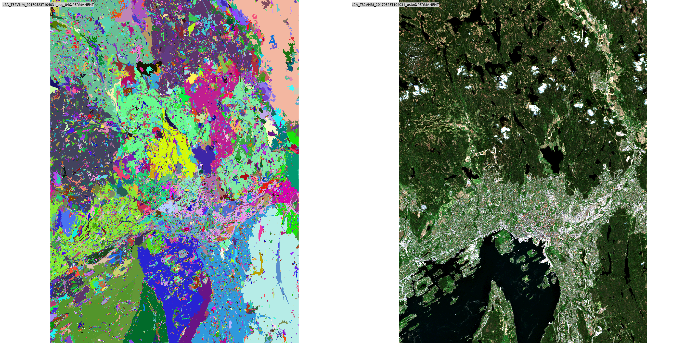
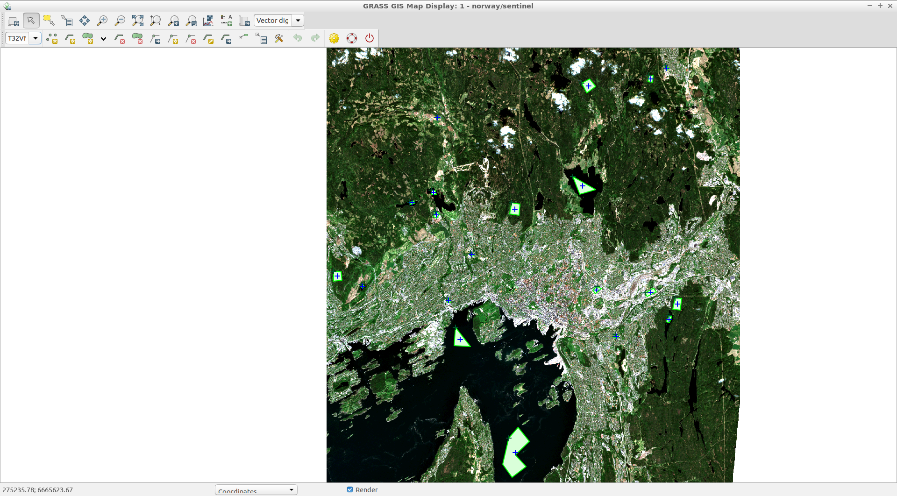

Unit 28 - Classification
========================

In GRASS GIS imagery data can be group (e.g. channel-wise) with :grasscmd:`i.group`.
Group and subgroups are used to enable the user to run analyses on any combination of
the raster map layers in a group. Some commands ask the user for the imagery group
and imagery subgroup whose data are to be analyzed.

.. code-block:: bash

   i.group group=L2A_T32VNM_20170523T104031 subgroup=L2A_T32VNM_20170523T104031 \
   input=`g.list rast pattern=L2A_T32VNM_20170523T104031_B* sep=comma`

.. tip::

   The first step as pre-analysis for a subsequent classification could be
   :grasscmd:`r.smooth.seg` to produces a smooth approximation of the data
   and performs discontinuity detection.

.. tip::

    In case of panchromatic maps or limited amount of channels, it is often
    recommended to generate synthetic channels through texture analysis :grasscmd:`r.texture`

Segmentation
-------------

GRASS GIS has a command, :grasscmd:`i.segment`, to run the identification of segments
(objects) from imagery data. 

.. code-block:: bash

   i.segment group=L2A_T32VNM_20170523T104031 output=L2A_T32VNM_20170523T104031_seg_04 threshold=0.4 memory=1000

   In the left the :grasscmd:`i.segment` output, in the right the original
   RGB bands

We create a new :param:`subgroup` with the segmented output

.. code-block:: bash

   i.group group=L2A_T32VNM_20170523T104031 subgroup=L2A_T32VNM_20170523T104031_segment \
   input=`g.list rast pattern=L2A_T32VNM_20170523T104031_B* sep=comma`,L2A_T32VNM_20170523T104031_seg_04

Unsupervised classification
----------------------------

Unsupervised classification can be done using two GRASS GIS modules,
:grasscmd:`i.cluster` and :grasscmd:`i.maxlik`.

:grasscmd:`i.cluster` generates spectral signatures for land cover types
in an image using a clustering algorithm. The resulting signature file is
used as input for :grasscmd:`i.maxlik`, to generate an unsupervised image classification.

.. code-block:: bash

   i.cluster group=L2A_T32VNM_20170523T104031 subgroup=L2A_T32VNM_20170523T104031
   signaturefile=cluster classes=3 reportfile=geodata/classi_cluster.txt

   i.maxlik group=L2A_T32VNM_20170523T104031 subgroup=L2A_T32VNM_20170523T104031
   signaturefile=cluster output=L2A_T32VNM_20170523T104031_cluster

Supervised classification
--------------------------

To run supervised classification the first step is to create the training areas.
You can use :grasscmd:`g.gui.iclass` or the vector digitizer :grasscmd:`g.gui.vdigit`
to create the vector containing your training areas.

We can use the `Vector digitizer` to create a `New vector`, call it
`T32VNM_20170523T104031_training` and add the following attribute columns:

* `class` varchar with 5 characters, for classes name
* `class_i` integer, for classes value
* `color` varchar with 11 characters, for color 

   
   The GRASS GIS vector digitizer

During the creation of vector you have to fill the attribute info, I suggest you
to fill only `class` or `class_i` column and after fill the other columns.

.. tip::

   You can use :grasscmd:`db.execute` to fill the others columns
   
   .. code-block:: bash
   
      db.execute sql="UPDATE T32VNM_20170523T104031_training set class_i=1 where class='water'"
      db.execute sql="UPDATE T32VNM_20170523T104031_training set class_i=2 where class='arti'"
      db.execute sql="UPDATE T32VNM_20170523T104031_training set class_i=3 where class='vege'"
      
      db.execute sql="UPDATE T32VNM_20170523T104031_training set color='35:167:234' where class='water'"
      db.execute sql="UPDATE T32VNM_20170523T104031_training set color='102:102:102' where class='arti'"
      db.execute sql="UPDATE T32VNM_20170523T104031_training set color='65:232:70' where class='vege'"

   .. figure:: ../images/units/28/training_attributes.png
      :class: small
      
      The attribute table of training vector

At this point we should convert the training areas vector to raster, we have
to use :grasscmd:`v.to.rast`

.. code-block:: bash

   v.to.rast input=T32VNM_20170523T104031_training output=T32VNM_20170523T104031_training \
   type=area use=attr attribute_column=class_i label_column=class rgb_column=color

.. figure:: ../images/units/28/trainings.png
   :class: medium

   The training areas

Now we have to choose the method to use, there are few methods:

* radiometric 
* radiometric and geometric
* machine learning

The radiometric method can be performed using :grasscmd:`i.gensig` to
generate statistics to be used in :grasscmd:`i.maxlik`

.. code-block:: bash

   i.gensig training=T32VNM_20170523T104031_training group=L2A_T32VNM_20170523T104031 \
   subgroup=L2A_T32VNM_20170523T104031 signaturefile=gensig_nosegment

   i.maxlik group=L2A_T32VNM_20170523T104031 subgroup=L2A_T32VNM_20170523T104031 \
   signaturefile=gensig_nosegment output=L2A_T32VNM_20170523T104031_maxlik

The radiometric and geometric method instead is using :grasscmd:`i.gensigset`
to generate statistics to be used in :grasscmd:`i.smap`, it performs contextual
image classification using sequential maximum a posteriori (SMAP) estimation.

.. code-block:: bash

   i.gensigset training=T32VNM_20170523T104031_training group=L2A_T32VNM_20170523T104031 \
   subgroup=L2A_T32VNM_20170523T104031 signaturefile=gensigset_nosegment

   i.smap group=L2A_T32VNM_20170523T104031 subgroup=L2A_T32VNM_20170523T104031 \
   signaturefile=gensigset_nosegment output=L2A_T32VNM_20170523T104031_smap \
   goodness=L2A_T32VNM_20170523T104031_smap_good

The machine learning method can be calculated using :grasscmdaddons:`r.learn.ml`,
the module represents a front-end to the `scikit-learn <http://scikit-learn.org>`__
python package.

.. note::

   :grasscmdaddons:`r.learn.ml` is an add-on so you have to install it
   through :grasscmd:`g.extension`. Note that
   :grasscmdaddons:`r.learn.ml` including dependecies is already
   installed on tailored :ref:`virtual machine <virtual-machine>`.

.. code-block:: bash

   r.learn.ml trainingmap=T32VNM_20170523T104031_training \
   group=L2A_T32VNM_20170523T104031 output=L2A_T32VNM_20170523T104031_learn
