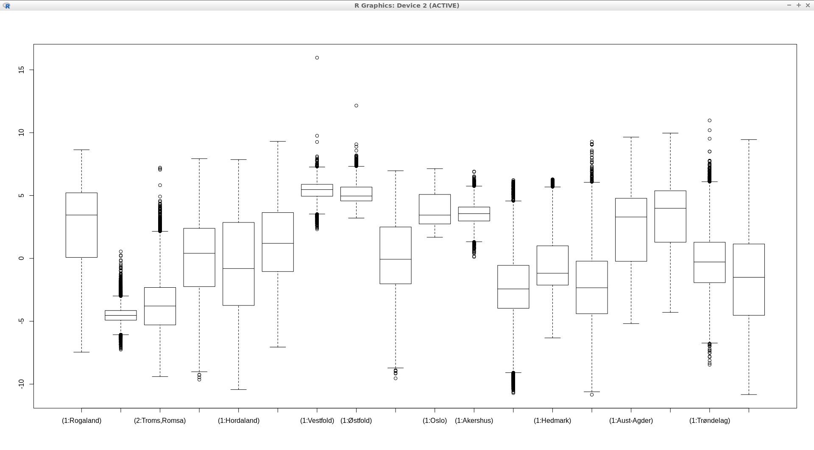

Unit 29 - GRASS and R
=====================

.. warning:: Materials under construction!

You can use R or RStudio in conjunction with GRASS GIS in two different ways: 

* run R within a GRASS GIS session
* run GRASS GIS within a R session

in both ways you have to install :param:`rgrass7` library inside a R or RStudio session

.. code-block:: R

   install.packages("rgrass7", dependencies= TRUE)

In our active GRASS GIS session start R and load :param:`rgrass7` library

.. code-block:: bash
                
   R

.. code-block:: R

   library(rgrass7)

If we are running GRASS GIS from within R (or RStudio) we need to use the
initGRASS() function to define the GRASS GIS settings, first get the full
path to GRASS GIS installation

.. code-block:: bash
                
   grass74 --config path
   
::

   /usr/lib/grass74

and later run the initGRASS() function, with the right parameters

.. code-block:: R
                
   initGRASS(gisBase='/usr/lib/grass74', gisDbase='/home/user/grassdata/',
             location='oslo-25832', mapset='PERMANENT', override=TRUE)

At this point you can use GRASS GIS functions inside R, for example
printing the list of vectors and convert Fylke vector to raster

.. code-block:: R

   execGRASS("g.list", parameters = list(type = "vector"))
   execGRASS("v.to.rast", parameters = list(input = "Fylke",
             output="fylke", use="cat", label_column="navn"))

We can read rasters into a R object, the cat parameter indicates which
raster values to be returned as factors

.. code-block:: R

   ncdata <- readRAST(c("fylke", "modis_avg"), cat=c(TRUE, FALSE))
   summary(ncdata)

::

   Object of class SpatialGridDataFrame
   Coordinates:
         min     max
   [1,] -572752 1039248
   [2,] 5539179 7836179
   Is projected: TRUE 
   proj4string :
   [+proj=utm +no_defs +zone=33 +a=6378137 +rf=298.257222101
    +towgs84=0,0,0,0,0,0,0 +to_meter=1]
   Grid attributes:
      cellcentre.offset cellsize cells.dim
   1           -572252     1000      1612
   2           5539679     1000      2297
   Data attributes:
                        fylke           modis_avg      
     (1:Nordland)          :  80964   Min.   :-11.1    
     (1:Trøndelag)         :  58662   1st Qu.: -1.7    
     (2:Troms,Romsa)       :  40760   Median :  4.2    
     (2:Finnmark,Finnmárku):  31257   Mean   :  3.4    
     (1:Hedmark)           :  27403   3rd Qu.:  8.7    
     (Other)               : 187401   Max.   : 16.1    
     NA's                  :3276317   NA's   :2450449  

It is possible to plot a boxplot of Norvegian regions with the 2017 annual
mean values of MODIS LST

.. code-block:: R

   boxplot(ncdata$modis_avg ~ ncdata$fylke, medlwd = 1)

